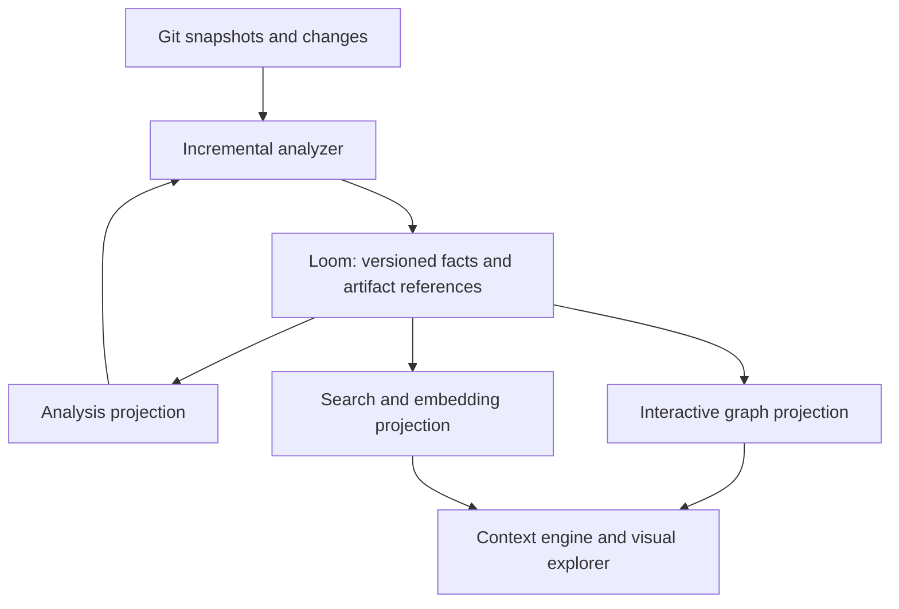

# Research: shared facts for code analysis and developer context

**Status: exploratory research, not a roadmap commitment or implementation
specification.** Recorded 2026-09-19. This note preserves a possible future
direction and questions worth investigating when there is a concrete consumer.
It proposes no immediate work, dependency adoption, or change to Loom's scope.

## Direction

A code analyzer and a developer context service can learn from the same
repository while needing very different representations and access patterns.
The hypothesis is that Loom could hold a shared, versioned foundation of facts
and artifact references, with separate projections for analysis, interactive
graph exploration, and retrieval. Each projection could optimize its workload
while remaining traceable to the same source version.

An incremental analyzer would contribute facts and their invalidations. A
context engine could use them to retrieve definitions, callers, relevant types,
source fragments, and change impact. A visual explorer could show the same
relationships and compare commits. LLM orchestration and the application UI
would remain downstream consumers, consistent with Loom's current boundaries.

This is a direction for a reusable data contract. It does not establish that
one physical database layout, graph engine, or cache should serve every consumer.

## Why Loom is relevant

At the reviewed Loom revision, the existing foundation includes typed objects
and links over Iceberg, snapshot history, lineage, access policy, transforms,
graph traversal, and vector search. Snapshot-producing writes can couple catalog
changes, lineage, and downstream job enqueue through the control plane. These
are useful building blocks, not evidence that code indexing at organization
scale is already supported.

The [Grimoire agenda](grimoire-kg-agenda.md#the-use-case-in-one-paragraph) already
describes a related arrangement: canonical, governed knowledge in Loom and a
disposable fast projection for a live application. This research extends that
idea to multiple concurrent workloads over code. It does not carry over that
consumer's small scale or its dataset-per-character partitioning strategy.

Current capability descriptions live in the [README](../README.md),
[query API](system-capabilities/query-api.md),
[ingest](system-capabilities/ingest.md), and
[transform](system-capabilities/transform.md) documentation. Named branching is
still listed as unfinished in the README. Storage snapshots alone do not provide
a Git-aware organization graph or a synchronized set of serving projections.

## Two workloads, different projections

| Concern | Incremental analysis | Developer context and visualization |
| --- | --- | --- |
| Main access pattern | Exact dependency lookups, batch processing, native analysis order | Search, bounded neighborhoods, paths, and source retrieval |
| Useful representation | Typed signatures, summaries, read dependencies, reusable engine artifacts | Stable symbols, explicit relationships, source spans, searchable chunks |
| Correctness boundary | Engine/configuration/rule identity and all inputs that affect an answer | Requested code version, provenance, visibility, and completeness |
| Performance objective | Reduce recomputation while preserving analysis results | Keep repeated interactive queries fast and predictable |
| Change handling | Revalidate observed inputs and propagate affected analysis | Replace changed facts, update indexes, invalidate affected query results |

An analysis dependency is not automatically a code relationship: a cache read
does not necessarily imply a call edge. Conversely, an interactive graph may
contain ownership, documentation, or deployment relationships irrelevant to an
analysis. Both can reference common entities without conflating their meaning.

A language-neutral structural representation is useful for discovery across
languages. It does not make resolution or data-flow semantics interchangeable.
Facts should retain producer, language, analysis mode, and resolution evidence;
an unresolved reference must remain distinguishable from a proven relationship.
Cross-repository links need evidence such as package/version resolution, rather
than matching symbol names across the organization.

## Candidate shared foundation

One possible arrangement is:



The foundation could describe repositories, commits, files, definitions,
references, relationships, and derived analysis results. It would need to
distinguish:

- **Entity identity:** what a fact refers to, independently of an engine's
  temporary symbol IDs. Identity across renames, moves, and ambiguous definitions
  remains a research question.
- **Version and ownership:** which source snapshot and analysis unit produced a
  fact, and which later publication replaces or retracts it.
- **Provenance and validity:** producer/schema versions, relevant configuration,
  observed dependencies, and rule identities where applicable. Source locations
  belong to a particular file version.
- **Artifacts:** references to immutable, typed engine objects or source blobs.
  Native AST, IL, and inference objects need not become individual ontology rows.

Code facts and analysis facts have different invalidation conditions. A new rule
may require new findings or summaries without changing definitions or call
relationships. A source edit may update a snippet and its embedding while leaving
a public signature unchanged. Reuse should follow the producer's actual validity
conditions; consumers should not infer it from filenames or timestamps alone.

Performance observations could accompany analysis units to inform scheduling,
sharding, or worker sizing. Such estimates would be advisory, with their own
engine, rule, and machine context; they could never justify a correctness hit.

## Main baselines and branch deltas

A possible operating model is durable indexing of main, with demand-driven
overlays for PRs and working trees. An overlay would be based on an exact indexed
ancestor and include all relevant changes through the requested head. Combining
a PR with today's main is a distinct merged view, not necessarily the PR's own
contents.

Conceptually:

```text
branch facts = baseline facts - superseded facts + replacement facts
```

This requires explicit deletions and ownership. A changed analysis unit must be
able to retract obsolete relationships; a deleted definition may require its
consumers to be resolved again. The affected semantic closure can extend beyond
Git's changed files. A shared generic AST does not remove that requirement.

An organization view would pin a set of repository commits and their analysis
publications. It would also need to express missing or stale repositories and
unresolved cross-repository dependencies. Neither an Iceberg snapshot ID nor a
database read sequence alone identifies that logical view.

## Keeping projections consistent

A common store makes synchronization possible, but does not synchronize separate
projections by itself. A potential contract would publish immutable fact deltas
and a manifest identifying a complete analysis, then let each projection apply
those deltas idempotently and record its progress.

A manifest could bind source commits to the relevant fact/artifact versions,
producer identities, and completeness information. Making a publication visible
would require a deliberate boundary across its constituent datasets. Partial
ingestion must not look like a complete code graph.

Projections could advance independently. An interactive request would select
compatible versions across the indexes it uses, fall back to an available
complete version when allowed, or report that the requested view is not ready.
A scan need not wait for an embedding rebuild. A database-consistent query is
still insufficient if it combines facts from incompatible analysis versions.

The contract would also need replay, retries, out-of-order completion, retirement,
and retention rules. Garbage collection must preserve artifacts still referenced
by a live baseline, overlay, query, or projection. Query caches need version and
access-scope identities; an accelerated path must retain Loom's policy semantics,
including restrictions on intermediate traversal nodes.

## Graph execution ideas to investigate

HydraDB is a useful implementation reference. Its documented architecture uses
compact immutable traversal indexes, a bounded overlay of recent committed
changes, pinned database snapshots, version-aware caches, and background index
workers separate from query serving. These mechanisms suggest ways to avoid
repeatedly reconstructing adjacency during interactive traversal. Its WAL overlay
addresses index freshness within a database; it is not a Git branch overlay.
See the [pinned architecture](https://github.com/hydra-db/hydradb/blob/6a2fbb192f37f51a93690a2ae2d2f5e27e6e4219/architecture.md).

Three avenues remain open: use Loom's existing graph queries; adapt selected
graph execution ideas into Loom's engine alongside relational execution; or
evaluate an external graph projection as a comparison. Incorporating ideas into
Loom could preserve one ontology, policy, and publication boundary, while adding
another execution path to maintain. No choice is made here, and no direct
Iceberg-to-Hydra index compatibility is assumed.

Any graph accelerator would need topology, properties, tombstones, and visibility
to agree on the selected logical version. A fast traversal of stale or mixed
facts is not a valid optimization.

## Scale questions and evidence that would matter

The motivating workload is tens of thousands of repositories, millions of
changes over time, and repeated queries from many developers. These are research
assumptions, not demonstrated capacity or service-level objectives.

Potential techniques include coalescing obsolete ingestion work while retaining
requested commits, sharing immutable content where its validity permits,
updating only affected projections, bounding interactive graph expansion, and
prioritizing active repositories or PRs. None eliminates worst-case semantic
fan-out, large dependency cycles, high-degree graph nodes, or cold-start cost.

Evidence worth collecting if this direction becomes actionable includes:

- **Correctness:** compare a baseline-plus-overlay view with independent indexing
  of the same head; include deletions, renames, rule/producer changes, unresolved
  dependencies, interrupted publication, and reordered events.
- **Interactive behavior:** use representative context and visual queries;
  measure warm and cold latency distributions, concurrency, traversal work,
  result usefulness, and policy enforcement.
- **Ingestion economics:** measure changed facts and affected analysis, write
  amplification, projection lag, storage growth, compaction, and retained history.
- **Architecture tradeoffs:** compare existing Loom traversal with an internal
  specialized graph path and an external projection under the same data and
  version contract. Include rebuild and operational costs, not just query speed.

Open questions include the smallest useful fact contract, which artifacts remain
engine-private, stable identity across revisions, cross-dataset publication,
branch-overlay compaction, cross-repository resolution, and when a specialized
graph path is worth its maintenance cost. These questions should be driven by a
concrete consumer before becoming implementation work.

## Research sources and status

- Loom reviewed at
  [`e6ca13c`](https://github.com/weave-hand/loom/tree/e6ca13cc43264dd8b2b1a067b675979c4ac323b0):
  [architecture](../ARCHITECTURE.md), the capability documents linked above, and
  the [Grimoire projection model](grimoire-kg-agenda.md).
- HydraDB reviewed through its
  [architecture at `6a2fbb1`](https://github.com/hydra-db/hydradb/blob/6a2fbb192f37f51a93690a2ae2d2f5e27e6e4219/architecture.md).
  Its documented mechanisms are research references, not a benchmark result for
  Loom or an integration commitment.
- The code fact contract, publication manifest, scan/context projections, and
  Git-aware overlays described here are hypotheses. This note creates no
  implementation backlog; future actionable work belongs in GitHub issues under
  Loom's existing work-tracking process.
