# STPA Control Analysis — weave-hand/loom @ 6931987

_Auto-generated STPA safety model: the unsafe states this system can reach and the control actions that get it there._

<b>How to read this</b> — STPA primer and diagram legend

**STPA** (System-Theoretic Process Analysis) treats the system as *controllers* issuing *control actions* to *controlled processes*, with *feedback* flowing back up. Instead of "what component can fail," it asks "what control action, given or withheld at the wrong time, drives the system into an unsafe state?" "Unsafe" here means a violation of the platform's reason to exist — governed correctness of data access and provenance — not merely a crash.

Read top-down: **Losses** are outcomes we must never cause; **Hazards** are system states that lead to a loss; the **control-structure diagram** shows who commands whom (solid arrows = control actions, dashed = feedback, a node tagged `(designed)` is in the architecture but **not yet built**); the **Unsafe Control Actions** table is the core. Every claim cites `path:line`; unbuilt elements are marked. Semantic, stable IDs mean regenerating changes only the findings that changed.

**Scope.** Built: control-plane library (6 concerns incl. auth), ingest service, query-api service, transform service, engine service (gRPC + Flight SQL + Flight data plane), engine-serving (DataFusion execution), flush-worker binary, and session-based auth middleware. Designed-only: Quack wire protocol (server).

Maturity detail

- **Built:** core traits (acl with Action::Read/Write scoping, ontology with links_to + define_action + identity, lineage, catalog, queue, auth with sessions + passwords, flush job contract, tx with create_table/append_files/replace_files/compact_files/snapshot), Postgres adapter, Iceberg mirror adapter + catalog + inline writes + flush + GC + schema evolution + CAS retry, in-memory adapter, Worker loop, query-api service (handler.rs, sql.rs, serving.rs, serving_datafusion.rs, action.rs, write_filter.rs, filter.rs, chain_filter.rs, params.rs, path_parse.rs, http.rs, render.rs, main.rs), ingest service (materialize.rs, write.rs, bind.rs, gate.rs, landing.rs, http.rs, main.rs), transform service (handler.rs, run.rs, typed.rs, compact.rs, conform.rs, backend.rs), engine service (service.rs, flight.rs, main.rs), engine-serving (serving.rs, pg_provider.rs), engine-wire (proto + client + convert + flight), flush-worker (handler.rs, main.rs), service_runtime auth middleware (protect, require_auth, login/logout)
- **Designed-only:** Quack wire protocol (loom as server for external ATTACH)

## Control structure

```mermaid
flowchart TD
  subgraph enforcement["Enforcement layer"]
    action-engine["Action engine (loom-owned DuckLake atomic writer via land_ducklake)"]
    engine["Engine gRPC service (queue + flush + GC delegation over UDS)"]
    flush-worker["Zero-pool flush worker binary (drains flush_table jobs via engine gRPC)"]
    ingest["Ingest service (DuckLake/Iceberg landing backends, model gate, HTTP surface, authn-gated)"]
    query-api["Query API (governed read/write: ontology resolve, ACL check + policy, link traversal with inverse hops, graph reachability, actions, HTTP surface, authn-gated)"]
    serving-engine["Serving engine (embedded DuckDB + Quack client + DataFusion/Iceberg backend, executes compiled SQL)"]
    transform["Transform service (queue-driven DataFusion jobs, typed transforms, selective compaction)"]
  end
  subgraph control-plane["Control plane (built)"]
    acl["Acl trait + Pg adapter (action-scoped policy store + check)"]
    auth["Auth trait + Pg adapter (password credentials, server-side sessions)"]
    catalog["Catalog trait (read-only DuckLake view)"]
    lineage["Lineage trait + Pg adapter (OpenLineage events)"]
    ontology["Ontology trait + Pg adapter (type-table resolve, links_to, define_action, identity)"]
    queue["Queue trait + Pg adapter (SKIP LOCKED + NOTIFY)"]
    tx["ControlPlane.begin / Tx (cross-concern transaction with snapshot writer)"]
    worker["Generic queue Worker loop"]
  end
  subgraph store["Stateful processes"]
    ducklake["DuckLake catalog + Parquet on object store"]
    iceberg-catalog["Iceberg mirror catalog + inline rows + Parquet on local filesystem"]
    postgres["Postgres (single coordinator, all schemas)"]
  end
  query-api -- "acl.check" --> acl
  query-api -- "acl.grant" --> acl
  query-api -- "acl.policies-for" --> acl
  query-api -- "acl.set-policy" --> acl
  query-api -- "action-engine.write-object" --> action-engine
  query-api -- "auth.resolve-session" --> auth
  flush-worker -- "engine.flush-table" --> engine
  ingest -- "lineage.emit" --> lineage
  query-api -- "ontology.define-type" --> ontology
  query-api -- "ontology.resolve" --> ontology
  worker -- "queue.complete" --> queue
  worker -- "queue.dequeue" --> queue
  ingest -- "queue.enqueue" --> queue
  worker -- "queue.fail" --> queue
  worker -- "queue.heartbeat" --> queue
  query-api -- "serving.fetch-rows" --> serving-engine
  ingest -- "tx.commit" --> tx
  ingest -- "tx.enqueue" --> tx
  acl -. "Decision Allow/Deny (no reason/obligations)" .-> query-api
  acl -. "Vec(Policy) row_filter + deny_columns, unmerged" .-> query-api
  auth -. "Verified SubjectId injected into request extensions (or 401)" .-> query-api
  engine -. "gRPC DequeueResponse (job or empty) + FlushTableResponse (snapshot_id)" .-> flush-worker
  postgres -. "pg_notify('loom_queue:'||kind) wakeup hint" .-> worker
  queue -. "await_jobs returns on NOTIFY or poll timeout" .-> worker
  queue -. "dequeued Job carries attempts count for backoff" .-> worker
  serving-engine -. "Rows (column names + typed cell values)" .-> query-api
```

## Losses

| ID | Loss |
|----|------|
| `L.integrity-loss` | Committed data, snapshots, or policy become corrupt or partially applied |
| `L.liveness-loss` | Enqueued work is never processed, or processed past its safety window |
| `L.provenance-loss` | Lineage diverges from what actually happened; provenance is missing or wrong |
| `L.silent-incorrectness` | A query returns wrong rows/columns while appearing successful |
| `L.unauthorized-access` | A subject reads or writes data it is not authorized for |

## Hazards

| ID | Hazard (unsafe state) | → Losses | Maturity |
|----|----|----|----|
| `dangling-target` | A grant/policy/lineage edge/ontology type references a target that does not exist or no longer maps to the intended table | L.unauthorized-access, L.silent-incorrectness | built |
| `lost-wakeup` | A NOTIFY wakeup is missed and eligible work waits up to the poll interval | L.liveness-loss | built |
| `partial-atomic-unit` | Standalone Lineage::emit and Queue::enqueue (outside Tx) run as their own transactions; a consumer that uses these instead of the Tx seam creates partial atomicity between snapshot, lineage, and job enqueue | L.provenance-loss, L.integrity-loss | built |
| `premature-reclaim` | A still-running job's lock is treated as expired and the job is re-dequeued and run concurrently/again | L.integrity-loss, L.provenance-loss | built |
| `stale-policy` | A policy is tightened or revoked between the handler's ACL fetch and the serving engine's query execution; the in-flight query runs under the prior, more-permissive policy | L.unauthorized-access, L.silent-incorrectness | built |
| `stuck-job` | A crashed worker leaves a job running with no reaper beyond lock-expiry reclaim, stalling that work | L.liveness-loss | built |
| `type-rebind` | An ontology type is upserted to point at a different physical table, silently redirecting reads under the old policy | L.unauthorized-access, L.silent-incorrectness | built |
| `unenforced-policy` | Read and action-write paths enforce policy in the query-api binary; the ingest HTTP endpoint, transform workers, and engine/flush-worker have no ACL check — any authenticated caller can land, transform, or flush data | L.unauthorized-access, L.silent-incorrectness | built |

## Control actions

| ID | Control action | Controller → Process | Maturity | Evidence |
|----|----|----|----|----|
| `acl.check` | coarse allow/deny decision for (subject,action,target) | `query-api` → `acl` | built | src/control-plane/postgres/src/acl.rs:349 |
| `acl.grant` | grant coarse (action,target) to role | `query-api` → `acl` | built | src/control-plane/postgres/src/acl.rs:169 |
| `acl.policies-for` | fetch row/column policy for subject+action+target | `query-api` → `acl` | built | src/control-plane/postgres/src/acl.rs:386 |
| `acl.set-policy` | create/replace row/column policy for role+action | `query-api` → `acl` | built | src/control-plane/postgres/src/acl.rs:244 |
| `action-engine.write-object` | execute atomic action write: one-row Parquet + lineage via land_ducklake | `query-api` → `action-engine` | built | src/services/query-api/src/action.rs:283 |
| `auth.resolve-session` | resolve bearer token to verified SubjectId (middleware gate on every request) | `query-api` → `auth` | built | src/services/runtime/src/auth.rs:75 |
| `engine.flush-table` | execute iceberg flush (inline rows to Parquet) for a table | `flush-worker` → `engine` | built | src/services/engine/src/service.rs:98 |
| `lineage.emit` | append OpenLineage event with inputs/outputs | `ingest` → `lineage` | built | src/control-plane/postgres/src/lineage.rs:59 |
| `ontology.define-type` | upsert object type + ordered properties | `query-api` → `ontology` | built | src/control-plane/postgres/src/ontology.rs:13 |
| `ontology.resolve` | resolve ontology type to physical TableRef | `query-api` → `ontology` | built | src/control-plane/postgres/src/ontology.rs:272 |
| `queue.complete` | delete finished job | `worker` → `queue` | built | src/control-plane/postgres/src/queue.rs:70 |
| `queue.dequeue` | claim next eligible job, mark running | `worker` → `queue` | built | src/control-plane/postgres/src/queue.rs:41 |
| `queue.enqueue` | enqueue job (autocommit) + NOTIFY | `ingest` → `queue` | built | src/control-plane/postgres/src/queue.rs:10 |
| `queue.fail` | record failure, retry or abandon | `worker` → `queue` | built | src/control-plane/postgres/src/queue.rs:79 |
| `queue.heartbeat` | refresh lock so long job not reclaimed | `worker` → `queue` | built | src/control-plane/postgres/src/queue.rs:110 |
| `serving.fetch-rows` | execute compiled read-only SQL against DuckLake or Iceberg catalog | `query-api` → `serving-engine` | built | src/services/query-api/src/serving.rs:180 |
| `tx.commit` | commit cross-concern unit of work (snapshot + lineage + queue) | `ingest` → `tx` | built | src/control-plane/postgres/src/transaction.rs:22 |
| `tx.enqueue` | enqueue within transaction (visible only on commit) | `ingest` → `tx` | built | src/control-plane/postgres/src/transaction.rs:49 |

## Unsafe control actions

*The core of the analysis. Each row: a control action made unsafe via one guideword, the hazard/loss it causes, and where in the code it lives.*

| ID | Control action | Guideword | Unsafe condition | Severity | → Hazards | Evidence |
|----|----|----|----|----|----|----|
| `acl.check.providing` | `acl.check` | providing | check returns Allow against a target matched by exact (kind,a,b) string equality, never resolving Type to Table; the handler always passes PolicyTarget::Type so a Table grant does not match and a Type grant misses the backing Table | high | dangling-target, unenforced-policy | src/services/query-api/src/handler.rs:185 |
| `acl.grant.providing` | `acl.grant` | providing | Table target grants are stored without catalog existence check (deferred); a Type grant on a type subsequently rebound via define_type silently covers a different physical table | medium | dangling-target | src/control-plane/postgres/src/acl.rs:169 |
| `acl.set-policy.wrong-timing` | `acl.set-policy` | wrong-timing | policy is tightened but in-flight queries already planned against the prior policy continue, reading rows now denied | medium | stale-policy | src/control-plane/postgres/src/acl.rs:244 |
| `engine.flush-table.not-providing` | `engine.flush-table` | not-providing | the engine gRPC service has no caller authentication; any process that can connect to the UDS can trigger flush, dequeue, complete, or fail any job — the trust boundary is the socket filesystem permission, not application-level auth | medium | unenforced-policy | src/services/engine/src/main.rs:42 |
| `lineage.emit.not-providing` | `lineage.emit` | not-providing | standalone Lineage.emit is its own transaction, so a snapshot can commit while the lineage event is never emitted (no atomic third leg) | medium | partial-atomic-unit | src/control-plane/postgres/src/lineage.rs:59 |
| `lineage.emit.providing` | `lineage.emit` | providing | emit stores inputs/outputs and opaque payload with no validation that referenced datasets exist or that envelope matches payload, recording false provenance | medium | dangling-target | docs/FUTURE.md:17 |
| `ontology.define-type.providing` | `ontology.define-type` | providing | upsert silently replaces a type's table binding with no validation that the new table exists or matches existing policy targets | medium | type-rebind, dangling-target | src/control-plane/postgres/src/ontology.rs:13 |
| `ontology.resolve.providing` | `ontology.resolve` | providing | the handler's get_type returns the current table mapping even after define-type rebound the type to a different physical table, so a query reads a table the caller's policy was not written for | high | type-rebind, unenforced-policy | src/services/query-api/src/handler.rs:194 |
| `queue.dequeue.wrong-timing` | `queue.dequeue` | wrong-timing | if heartbeat writes fail (best-effort, fire-and-forget) during a network partition while the original worker still processes the job, locked_at ages past lock_timeout and a second worker reclaims it, duplicating a snapshot-producing transform | high | premature-reclaim | src/control-plane/postgres/src/queue.rs:49 |

<b>Not UCAs</b> — 16 examined and rejected

- **Tx lacks catalog write (partial atomic unit)** — Tx now includes create_table + append_files + replace_files + compact_files; commit_snapshot lands all legs atomically (src/control-plane/postgres/src/transaction.rs:22)
- **acl.check not issued (unbuilt query API)** — handler provides deny-by-default check before any type resolution (src/services/query-api/src/handler.rs:185)
- **action lineage non-atomic with inline write** — fixed: DuckLakeActionWriter routes through land_ducklake, committing row + lineage in one Postgres Tx (src/services/query-api/src/action.rs:283)
- **auth.resolve-session forged token** — tokens are random 32-byte values; only the SHA-256 is stored; resolve checks expiry and returns None for unknown/expired tokens (src/services/runtime/src/auth.rs:75)
- **await_jobs missed NOTIFY / spurious early return** — bounded by 5s poll fallback that re-checks via dequeue (src/control-plane/worker/src/lib.rs:19,131)
- **crashed-worker job left running** — recovered by lock-expiry reclaim in dequeue; only a UCA when heartbeat fails for a live worker (premature-reclaim)
- **define_action does not validate param conformance to target type** — now validated at invoke time by check_conformance before any insert (src/services/query-api/src/action.rs:95)
- **graph traversal unbounded recursion** — depth bounded by MAX_GRAPH_DEPTH=10 in http.rs:279 and compiled into the recursive CTE; path enforced cyclic (handler.rs)
- **handler never calls heartbeat** — worker loop now heartbeats automatically at lease/3 intervals (src/control-plane/worker/src/lib.rs:97)
- **iceberg flush advisory-lock hash instability** — DefaultHasher is deterministic within one binary; lock_key is only called from the engine binary so all workers share the same hash function (src/control-plane/postgres/src/iceberg_flush.rs:138)
- **memory adapter notify_waiters race losing a wakeup** — same poll-timeout fallback bounds latency by design (src/control-plane/memory/src/queue.rs:89)
- **multiple-role policy merging absent** — handler ANDs row_filters and unions deny/mask columns across all matching policies (src/services/query-api/src/handler.rs:83)
- **pg_notify fired inside rolled-back transaction** — NOTIFY is buffered until commit so a rolled-back enqueue is silent, not a spurious wakeup (src/control-plane/postgres/src/queue.rs:10)
- **policies fetched but never folded into query** — handler compiles row_filter trees and deny/mask columns into the SELECT via sql::compile_select (src/services/query-api/src/handler.rs:296)
- **quote_ident panics on embedded double-quote** — fixed: escapes via SQL-standard doubling instead of panicking (src/services/query-api/src/sql.rs:38)
- **write-filter UNKNOWN denies the write** — three-valued eval is fail-closed; a type mismatch or NaN denies the write rather than permitting it (src/services/query-api/src/write_filter.rs:169)

## Open questions

- ACL targets are matched by exact (kind,a,b) string equality and Type is never resolved to Table for checks — is a Type grant intended to also cover the backing Table at enforcement time, and where does that resolution happen safely?
- Flight do_get ticket reads any named path without table-membership check (iss-flight-ticket-path-unchecked); a caller on the UDS can read arbitrary object-store paths not belonging to any table.
- How are concurrent ingest writers and DuckLake snapshot ordering reconciled (multi-writer is an open question), given the advisory-lock serialization in snapshot.rs serializes within one Postgres database?
- Is there a stuck-job reaper distinct from lock-expiry reclaim, or does a job whose worker crashes after lock expiry but is never re-eligible (e.g. wrong kind set) stall indefinitely?
- The DataFusion serving engine registers ALL live Iceberg tables per query (engine-serving/src/serving.rs); a deployment with many tables pays a per-query metadata scan that could become a latency or DoS concern.
- The engine gRPC service trusts the UDS filesystem boundary for all queue and flush operations — is process-level isolation (container, namespace) sufficient, or should application-level authentication be added before multi-tenant deployment?

