# STPA Control Analysis: weave-hand/loom @ b81431d

_Auto-generated STPA safety model: the unsafe states this system can reach and the control actions that get it there._

<b>How to read this</b>: STPA primer and diagram legend

**STPA** (System-Theoretic Process Analysis) treats the system as *controllers* issuing *control actions* to *controlled processes*, with *feedback* flowing back up. Instead of "what component can fail," it asks "what control action, given or withheld at the wrong time, drives the system into an unsafe state?" "Unsafe" here means a violation of the platform's reason to exist (governed correctness of data access and provenance), not merely a crash.

Read top-down: **Losses** are outcomes we must never cause; **Hazards** are system states that lead to a loss; the **control-structure diagram** shows who commands whom (solid arrows = control actions, dashed = feedback, a node tagged `(designed)` is in the architecture but **not yet built**); the **Unsafe Control Actions** table is the core, and **Unsafe Feedback** covers the dashed arrows: data channels whose absence, staleness, corruption, or spoofing drives a controller into a hazard. Every claim cites `path:line`; unbuilt elements are marked. Semantic, stable IDs mean regenerating changes only the findings that changed.

**Scope.** The control plane (all five concerns), ingest service, query-api (governed reads + writes + links + lineage ACL filtering + Flight export + external SQL wire), engine service, transform workers, CDC merge engines, and the standalone composite are built; ontology versioning/migration and distributed DataFusion / Ballista are designed-only.

Maturity detail

- **Built:** control-plane (queue, catalog, ontology, ACL, lineage), postgres adapter, worker loop (flush, GC, compact, transform, typed-transform, build_vector_index, stream_consolidate), ingest (landing, materializer, model-binding), query-api (governed object reads, typed insert/update/delete, governed links, lineage ACL-filtered reads, Flight export, external SQL wire slice 1), engine (DataFusion serving over Flight SQL, vector search, flush, GC, consolidate, merge-on-read), service runtime (auth, admin provisioning, service accounts), CDC merge engines (LastRow, FirstRow, Versioned), action downstream (write-then-enqueue), standalone composite, UI (Yew WASM), OCI deploy
- **Designed-only:** ontology versioning/migration, distributed DataFusion / Ballista, multi-hop traversal keyset pagination, aggregate-class merge engines (Aggregation, PartialUpdate)

## Control structure

```mermaid
flowchart TD
  subgraph enforcement["Enforcement layer"]
    acl["Acl trait (row/column policy)"]
    auth["Auth middleware (session + service-token)"]
    lineage-filter["Lineage ACL filter (cut-not-skip BFS)"]
  end
  subgraph control-plane["Control plane (built)"]
    catalog["Catalog (Iceberg mirror)"]
    consolidate-worker["Stream consolidate worker"]
    flush-worker["Flush / compaction worker"]
    ingest["Ingest service"]
    lineage["Lineage store"]
    ontology["Ontology (typed-object registry)"]
    query-api["Query API (governed reads + writes)"]
    queue["Job queue"]
    transform["Transform workers (physical + typed)"]
    worker["Worker loop (dequeue + dispatch)"]
  end
  subgraph store["Stateful processes"]
    ducklake["DuckLake SQL catalog"]
    engine["Engine service (DataFusion + Flight)"]
    iceberg["Iceberg tables (Parquet on S3)"]
    postgres["Postgres (unified control plane)"]
  end
  query-api -- "acl.check" --> acl
  query-api -- "acl.grant" --> acl
  query-api -- "acl.set-policy" --> acl
  query-api -- "auth.provision" --> auth
  query-api -- "auth.resolve" --> auth
  ingest -- "catalog.register" --> catalog
  consolidate-worker -- "consolidate.fold" --> engine
  query-api -- "engine.query" --> engine
  query-api -- "engine.vector-search" --> engine
  query-api -- "engine.write" --> engine
  flush-worker -- "gc.reclaim" --> iceberg
  ingest -- "ingest.land" --> iceberg
  query-api -- "lineage.emit" --> lineage
  query-api -- "lineage.filter" --> lineage-filter
  query-api -- "ontology.resolve" --> ontology
  worker -- "queue.complete" --> queue
  worker -- "queue.dequeue" --> queue
  ingest -- "queue.enqueue" --> queue
  worker -- "queue.fail" --> queue
  transform -- "transform.commit" --> engine
  ingest -- "tx.commit" --> postgres
  acl -. "Policy rows for subject+target" .-> query-api
  catalog -. "live_tables() snapshot list" .-> engine
  engine -. "Arrow IPC result batches" .-> query-api
  engine -. "Arrow Flight input batches for transform SQL" .-> transform
  lineage -. "One-hop closure nodes per BFS frontier" .-> lineage-filter
  ontology -. "ObjectType + TableRef resolution" .-> query-api
  ontology -. "Type-to-TableRef resolution for typed transforms" .-> transform
  postgres -. "NOTIFY wakeup hint" .-> worker
```

## Losses

| ID | Loss |
|----|------|
| `L.integrity-loss` | Data written or returned is silently wrong (schema drift, partial write, stale read) |
| `L.liveness-loss` | Platform stops making progress (stuck queue, leaked locks, blocked compaction) |
| `L.provenance-loss` | Lineage record is incomplete, fabricated, or disconnected from the data it describes |
| `L.silent-incorrectness` | Query returns incorrect rows/columns without any error signal to the caller |
| `L.unauthorized-access` | A principal reads or mutates data they are not entitled to |

## Hazards

| ID | Hazard (unsafe state) | → Losses | Maturity |
|----|----|----|----|
| `bypassed-gate` | A write reaches the engine without passing the governance prologue (direct engine access or code path that skips ACL) | L.unauthorized-access | built |
| `consolidate-lost-write` | A CDC consolidation folds the base while a concurrent mutation commits between the fold read and the overwrite, silently dropping the mutation | L.integrity-loss | built |
| `cow-partial` | A copy-on-write UPDATE/DELETE crashes mid-overwrite, leaving the table with a partial snapshot | L.integrity-loss | built |
| `dangling-lineage` | A lineage event references a snapshot that was never committed or has been GC'd | L.provenance-loss | built |
| `gc-live-delete` | GC deletes a data file still referenced by a live snapshot | L.integrity-loss, L.liveness-loss | built |
| `lineage-gap` | A data-mutating operation completes without emitting a lineage event | L.provenance-loss | built |
| `lineage-over-disclosure` | Lineage traversal reveals nodes or payloads the caller has no Read grant for | L.unauthorized-access | built |
| `phantom-rows` | Query returns rows the caller's policy should have filtered out | L.unauthorized-access, L.silent-incorrectness | built |
| `stale-policy` | ACL policy used for a request reflects a revoked or outdated grant | L.unauthorized-access | built |
| `stale-type` | Ontology resolution returns a TableRef pointing at a dropped or replaced backing table | L.silent-incorrectness, L.integrity-loss | built |
| `stuck-queue` | Jobs accumulate without being dequeued or retried, halting pipeline progress | L.liveness-loss | built |
| `transform-shadow` | Transform reads shadowed inputs (DataFusion silently uses the last-registered table when duplicate names collide) | L.silent-incorrectness, L.integrity-loss | built |

## Control actions

| ID | Control action | Controller → Process | Maturity | Evidence |
|----|----|----|----|----|
| `acl.check` | Check read/write permission for subject+target | `query-api` → `acl` | built | governed.rs:67 |
| `acl.grant` | Grant a role-scoped permission | `query-api` → `acl` | built | postgres/src/acl.rs:197 |
| `acl.set-policy` | Attach row/column filter policy to a role | `query-api` → `acl` | built | postgres/src/acl.rs:318 |
| `auth.provision` | Create user / service-account (admin-gated) | `query-api` → `auth` | built | runtime/src/auth.rs:459 |
| `auth.resolve` | Resolve bearer token to verified subject | `query-api` → `auth` | built | runtime/src/auth.rs:95 |
| `catalog.register` | Register or update an Iceberg table snapshot | `ingest` → `catalog` | built | postgres/src/iceberg_catalog.rs |
| `consolidate.fold` | Fold CDC base by identity (LastRow/FirstRow/Versioned) | `consolidate-worker` → `engine` | built | engine-serving/src/consolidate.rs:57 |
| `engine.query` | Execute governed SQL via internal Flight SQL | `query-api` → `engine` | built | engine_client.rs:34 |
| `engine.vector-search` | kNN vector search on an indexed column | `query-api` → `engine` | built | engine-serving/src/vector_search.rs:57 |
| `engine.write` | Land governed write (insert/overwrite) via engine control | `query-api` → `engine` | built | engine-serving/src/action_writer.rs:74 |
| `gc.reclaim` | Delete orphaned snapshots and data files | `flush-worker` → `iceberg` | built | postgres/src/iceberg_gc.rs:68 |
| `ingest.land` | Materialise raw data into an Iceberg snapshot | `ingest` → `iceberg` | built | ingest/src/landing.rs |
| `lineage.emit` | Record a lineage event for a snapshot transition | `query-api` → `lineage` | built | postgres/src/lineage.rs:62 |
| `lineage.filter` | ACL-filtered lineage closure (cut-not-skip BFS) | `query-api` → `lineage-filter` | built | lineage_filter.rs:198 |
| `ontology.resolve` | Resolve a type name to its backing table | `query-api` → `ontology` | built | postgres/src/ontology.rs:305 |
| `queue.complete` | Mark a dequeued job as completed | `worker` → `queue` | built | postgres/src/queue.rs:104 |
| `queue.dequeue` | Claim the next available job (SELECT FOR UPDATE SKIP LOCKED) | `worker` → `queue` | built | postgres/src/queue.rs:75 |
| `queue.enqueue` | Submit a new job (flush, compaction, transform, downstream) | `ingest` → `queue` | built | postgres/src/queue.rs:70 |
| `queue.fail` | Return a failed job for retry or dead-letter | `worker` → `queue` | built | postgres/src/queue.rs:113 |
| `transform.commit` | Commit transform output (files + lineage) atomically | `transform` → `engine` | built | worker/src/transform.rs:348 |
| `tx.commit` | Commit a multi-table transaction atomically | `ingest` → `postgres` | built | postgres/src/transaction.rs:24 |

## Unsafe control actions

*The core of the analysis. Each row: a control action made unsafe via one guideword, the hazard/loss it causes, and where in the code it lives.*

| ID | Control action | Guideword | Unsafe condition | Severity | → Hazards | Evidence |
|----|----|----|----|----|----|----|
| `acl.check.not-providing` | `acl.check` | not-providing | A code path reaches the engine without calling acl.check (e.g. the engine's UDS has no application-level auth; any process on the host can connect) | high | bypassed-gate, phantom-rows | engine/src/main.rs:15 |
| `acl.check.providing` | `acl.check` | providing | acl.check returns Allow but the loaded policy rows are stale (fetched before a concurrent revoke committed), so the SQL embeds a filter the caller no longer satisfies | high | stale-policy, phantom-rows | governed.rs:67 |
| `auth.resolve.not-providing` | `auth.resolve` | not-providing | A route is mounted outside the protect() middleware (misconfiguration), so requests reach handlers without a verified Subject | high | bypassed-gate | runtime/src/auth.rs:111 |
| `consolidate.fold.wrong-timing` | `consolidate.fold` | wrong-timing | consolidate_stream folds the base and commits via overwrite_parquet_snapshot while a concurrent mutation commits between the fold read and the overwrite, silently dropping the mutation (known issue #iss-consolidate-stream-lost-write) | high | consolidate-lost-write | engine-serving/src/consolidate.rs:57 |
| `engine.write.providing` | `engine.write` | providing | engine.write is invoked after ACL allowed the write, but a concurrent policy revoke means the row should no longer be writable — the write lands anyway | medium | stale-policy | engine-serving/src/action_writer.rs:74 |
| `gc.reclaim.wrong-timing` | `gc.reclaim` | wrong-timing | GC deletes data files between a reader's catalog snapshot and its actual file read, causing a dangling-file query error | medium | gc-live-delete | postgres/src/iceberg_gc.rs:68 |
| `lineage.emit.not-providing` | `lineage.emit` | not-providing | An error after the data write but before lineage.emit means the snapshot exists with no provenance record | medium | lineage-gap | postgres/src/lineage.rs:62 |
| `lineage.filter.not-providing` | `lineage.filter` | not-providing | Lineage endpoint returns nodes or event payloads the caller lacks Read permission for (filter bypass or incomplete redaction) | high | lineage-over-disclosure | lineage_filter.rs:198 |
| `ontology.resolve.wrong-timing` | `ontology.resolve` | wrong-timing | Ontology resolution returns a TableRef that was valid at resolve time but the backing table is dropped or replaced before the query executes | low | stale-type | postgres/src/ontology.rs:305 |
| `queue.dequeue.wrong-timing` | `queue.dequeue` | wrong-timing | Lock-timeout reclaim dequeues a job whose original worker is still running (slow but alive), causing duplicate execution of a side-effecting job | medium | stuck-queue | postgres/src/queue.rs:75 |
| `queue.fail.not-providing` | `queue.fail` | not-providing | Worker panics or is killed between dequeue and fail/complete — the job stays running with no heartbeat until lock timeout, delaying retry | medium | stuck-queue | postgres/src/queue.rs:113 |
| `transform.commit.wrong-timing` | `transform.commit` | wrong-timing | Transform reads input tables at snapshot T, but a concurrent ingest commits new data at T+1 before the transform commits — the output reflects stale inputs while lineage records the current snapshot, creating a provenance/data mismatch | medium | dangling-lineage, lineage-gap | worker/src/transform.rs:348 |
| `tx.commit.wrong-timing` | `tx.commit` | wrong-timing | Transaction commits the catalog entry and enqueues a flush job, but crashes before the COMMIT — Postgres rolls back both atomically, so no data is lost, but the inverse (commit succeeds, subsequent non-transactional step fails) can leave a committed snapshot with no flush job | medium | dangling-lineage, lineage-gap | postgres/src/transaction.rs:24 |

## Unsafe feedback

*Feedback and data channels whose absence, staleness, corruption, or spoofed origin drives a controller into a hazard. This is where data-integrity failures live.*

| ID | Channel | Guideword | Unsafe condition | Severity | → Hazards | Evidence |
|----|----|----|----|----|----|----|
| `catalog-snapshot.stale` | `catalog` → `engine`: live_tables() snapshot list | stale | Engine registers table snapshots at query-plan time; a concurrent ingest commit updates the catalog after registration, so the query reads a stale snapshot — not wrong, but the staleness window is unbounded (no invalidation signal) | low | stale-type | engine-serving/src/serving.rs:74 |
| `lineage-closure.stale` | `lineage` → `lineage-filter`: one-hop closure nodes per BFS frontier | stale | LineageVisibility BFS checks Acl::check at traversal time but a concurrent grant/revoke between hops means the visible set is inconsistent — some nodes are gated with pre-revoke policy, others with post-revoke | low | lineage-over-disclosure | lineage_filter.rs:104 |
| `policy-fetch.stale` | `acl` → `query-api`: policy rows for subject+target | stale | load_policy fetches policy rows in a separate query after the acl.check gate; a concurrent revoke between the two calls means the query runs with a policy the subject no longer holds | high | stale-policy, phantom-rows | governed.rs:103 |

<b>Not UCAs</b>: 30 examined and rejected

- **Flight export governed SQL**: FlightExportService runs the governed SQL path (GovernedStatementQuery) through the same ACL prologue as object reads; the Arrow stream carries the same row/column governance as the JSON path
- **Flight export with revoked token mid-stream**: the auth gate runs once at request start; a token revoked during streaming does not interrupt the in-flight response — bounded by the query's execution time, not a persistent access leak
- **acl.check false-deny on concurrent grant**: false-deny (returns Deny when a concurrent grant would Allow) is a liveness nuisance, not an integrity violation; the caller retries and gets the updated policy
- **acl.grant replay**: grant is idempotent (INSERT ON CONFLICT DO NOTHING); a replayed grant does not widen access
- **acl.set-policy with wrong column names**: set_policy validates column names against the ontology type at write time; a malformed policy is rejected, not silently applied
- **admin provision without audit**: create-user / create-service-account log via tracing but do not emit a lineage event — admin actions are control-plane metadata, not data mutations; an audit trail is a future enhancement, not a safety gap
- **auth.resolve with expired token**: resolve_session/resolve_service_token check expiry at evaluation time; an expired token is rejected, not silently accepted
- **await_jobs missed NOTIFY**: bounded by 5s poll fallback (worker/src/lib.rs via WorkerTuning poll_interval)
- **catalog.register with duplicate snapshot id**: Postgres UNIQUE constraint on snapshot id rejects the duplicate; the caller gets a Conflict error
- **cow-overwrite crash recovery**: Iceberg's atomic manifest swap means a crash during overwrite_table leaves the prior snapshot valid; the partial new snapshot is never visible
- **engine UDS file permissions**: the engine binds a Unix domain socket; access control is filesystem-level (container boundary) — standard for sidecar-pattern internal services
- **engine.query plan error on bad SQL**: DataFusion returns a plan error surfaced as ServingError::Plan (400); no silent wrong result
- **engine.query with no registered tables**: execute_query registers all live_tables before planning; an empty catalog yields an empty result, not an error — correct for a fresh system
- **external SQL wire governed**: external SQL wire slice 1 uses GovernedStatementQuery with the same ACL enforcement as the internal path; the wire adds a TCP listener + auth but does not bypass governance
- **gc.reclaim on already-deleted file**: S3 DELETE is idempotent; deleting an already-removed file is a no-op
- **heartbeat storm under high concurrency**: heartbeat is a single UPDATE by job id; concurrent heartbeats serialize on the row lock and the last-write-wins timestamp is monotonic
- **ingest.land with schema mismatch**: landing validates the Arrow schema against the target table; a mismatch is rejected before any data is written
- **lineage read with no ACL per node (legacy)**: lineage endpoints now enforce per-node ACL via LineageVisibility (lineage_filter.rs); the prior deferred gap is closed
- **lineage.emit with duplicate event**: lineage events are append-only with a server-generated id; a duplicate emit creates two records but does not corrupt the graph
- **ontology.resolve for unknown type**: resolve returns NotFound (404); the handler surfaces this to the caller — no silent fallback
- **queue.complete on already-completed job**: complete transitions state to 'completed' only from 'running'; a second complete is a no-op (UPDATE WHERE id=$1 AND state='running' matches zero rows)
- **queue.dequeue under zero load**: dequeue returns None; the worker loop sleeps until the next poll or NOTIFY — no resource waste
- **queue.enqueue with oversized payload**: Postgres TEXT column accepts arbitrary length; an oversized payload is a capacity concern, not a correctness one, and is bounded by the HTTP body limit upstream
- **queue.fail with exhausted retries**: RetryPolicy caps retries; a job that exceeds the cap transitions to 'dead' — visible in the queue table for manual intervention
- **service-token mint with max_ttl**: token TTL is capped by LOOM_SERVICE_TOKEN_MAX_TTL (default 90d); a request above the cap is rejected 400 — no immortal tokens
- **transform conformance gate**: typed transforms check output conformance BEFORE any rows are written; a non-conforming result writes/commits nothing (worker/src/transform.rs:303)
- **transform duplicate input name**: run_wire_transform rejects duplicate input registration names up front; DataFusion shadowing is prevented (worker/src/transform.rs:235)
- **tx.commit read-only transaction**: a transaction with no writes commits as a no-op; Postgres COMMIT on an empty transaction is harmless
- **vector-search dimension mismatch**: the engine returns DimMismatch error; query-api surfaces it as a 400 — no silent wrong result
- **write_filter eval on NULL column**: three-valued eval returns None (unknown) on NULL; callers treat None as deny (fail-closed) (write_filter.rs:110)

## Open questions

- Ballista escalation: when DataFusion is distributed, how does row-level ACL pushdown interact with shuffle partitions?
- Catalog read ACL gating: list_datasets/get_dataset/dataset_preview take _subject unused — any authenticated caller can preview any dataset, while lineage reads are per-ref gated (known issue #iss-catalog-lineage-acl-asymmetry)
- Consolidate-stream lost-write fix: the overwrite_parquet_snapshot_consuming primitive (retire-only-what-you-read) is designed but not yet built (#iss-consolidate-stream-lost-write)
- GC hold-off protocol: should readers acquire a short-lived lease to prevent gc.reclaim from deleting files they are about to read?
- Multi-writer ingest: concurrent ingest to the same table can produce conflicting snapshots; is last-writer-wins acceptable or does the catalog need compare-and-swap?
- Ontology migration: how are in-flight queries handled when a type's backing table is replaced (schema evolution)?
- Queue poison pill: a repeatedly-failing job that exhausts retries becomes 'dead' but is never cleaned up — should there be an alert or reaper?
- Tenancy isolation: if loom supports multiple tenants, does the current single-Postgres model provide sufficient isolation?
- Transform snapshot isolation: transform reads inputs at an un-pinned snapshot; concurrent ingest can update inputs between the read and the commit, so the output may reflect a mix of snapshot versions
