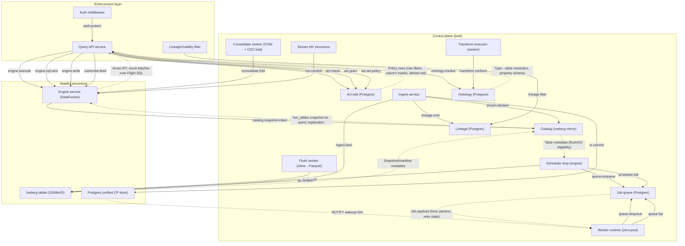

# STPA Control Analysis: weave-hand/loom @ d99146b

_Auto-generated STPA safety model: the unsafe states this system can reach and the control actions that get it there._

<b>How to read this</b>: STPA primer and diagram legend

**STPA** (System-Theoretic Process Analysis) treats the system as *controllers* issuing *control actions* to *controlled processes*, with *feedback* flowing back up. Instead of "what component can fail," it asks "what control action, given or withheld at the wrong time, drives the system into an unsafe state?" "Unsafe" here means a violation of the platform's reason to exist (governed correctness of data access and provenance), not merely a crash.

Read top-down: **Losses** are outcomes we must never cause; **Hazards** are system states that lead to a loss; the **control-structure diagram** shows who commands whom (solid arrows = control actions, dashed = feedback, a node tagged `(designed)` is in the architecture but **not yet built**); the **Unsafe Control Actions** table is the core, and **Unsafe Feedback** covers the dashed arrows: data channels whose absence, staleness, corruption, or spoofing drives a controller into a hazard. Every claim cites `path:line`; unbuilt elements are marked. Semantic, stable IDs mean regenerating changes only the findings that changed.

**Scope.** All three service pillars (Ingest, Transform workers, Query API) are live; the engine service, Postgres control plane, and Iceberg store are built; external SQL wire and distributed DataFusion are deferred.

Maturity detail

- **Built:** queue, catalog, ontology, ACL, lineage, ingest (snapshot-commit, landing materializer, dataset→model binding, multi-file write), query-api (governed object reads, typed-object serialization, link traversal, graph queries, typed-insert/update/delete actions, catalog views, vector search, subscribe feed, lineage filter, Flight SQL export), engine (DataFusion serving, flush, GC, compaction, COW consolidate, stream MV, inline shadow writes), transform (physical SQL, typed), auth (JWT, admin), scheduler, stream/CDC declaration
- **Designed-only:** external SQL wire (TCP listener + auth), distributed DataFusion / Ballista, ontology migration, multi-writer ingest

## Control structure

## Losses

| ID | Loss |
|----|------|
| `L.integrity-loss` | Silent data corruption or schema drift — a stored table no longer matches its declared ontology type, or a write commits data that violates the schema/conformance contract. |
| `L.liveness-loss` | A service or job becomes permanently stuck, starved, or unable to make progress, causing data to stop flowing. |
| `L.provenance-loss` | Lineage records are silently dropped, fabricated, or misattributed — the audit trail no longer reflects what actually happened. |
| `L.silent-incorrectness` | A governed query returns wrong data — stale snapshots, phantom/missing rows, wrong join results — without any error signal to the caller. |
| `L.unauthorized-access` | A subject reads or writes data it should not have access to, or a governance bypass leaks rows/columns past ACL policy. |

## Hazards

| ID | Hazard (unsafe state) | → Losses | Maturity |
|----|----|----|----|
| `acl-bypass-column` | A query returns column data the subject's column-mask policy should have hidden. | L.unauthorized-access | built |
| `acl-bypass-row` | A query returns rows the subject's row-filter policy should have excluded. | L.unauthorized-access | built |
| `consolidate-lost-write` | A consolidation fold overwrites inline rows that a concurrent write appended after the fold's read, silently dropping the concurrent write. | L.integrity-loss, L.silent-incorrectness | built |
| `dangling-lineage` | A lineage event references a dataset that was never committed or has been dropped, creating an unresolvable provenance edge. | L.provenance-loss | built |
| `gc-reclaim-live` | GC deletes a Parquet file that an in-flight query or snapshot still references, causing a read error or silent data loss. | L.silent-incorrectness, L.liveness-loss | built |
| `job-poison` | A failing job is retried indefinitely, consuming the single-threaded worker and starving all other job kinds. | L.liveness-loss | built |
| `lineage-filter-leak` | The lineage BFS filter expands through a denied node, revealing transitive provenance the subject should not see. | L.unauthorized-access | built |
| `mv-ghost-rows` | A materialized view serves rows derived from source data the subject cannot read, bypassing ACL on the source. | L.unauthorized-access, L.silent-incorrectness | built |
| `mv-watermark-stale` | The MV watermark advances past events that were never processed, silently dropping source rows from the materialized view. | L.silent-incorrectness, L.integrity-loss | built |
| `orphan-parquet` | Parquet files written by a crashed/abandoned commit are never cleaned up, leaking storage indefinitely. | L.liveness-loss | built |
| `partial-atomic-unit` | A multi-file landing commits only a subset of its files, leaving the table in a state that violates the all-or-nothing contract. | L.integrity-loss | built |
| `schema-drift` | A landed dataset's inferred schema silently diverges from its ontology type's declared properties, causing downstream query failures or wrong casts. | L.integrity-loss, L.silent-incorrectness | built |
| `stale-policy` | ACL policy is cached or captured at a point in time; a subsequent policy change is not reflected until re-read, creating a window where the old policy governs queries. | L.unauthorized-access | built |
| `subscribe-policy-drift` | The subscribe change feed captures governance at connect time; policy changes mid-stream are not applied until the client reconnects. | L.unauthorized-access | built |

## Control actions

| ID | Control action | Controller → Process | Maturity | Evidence |
|----|----|----|----|----|
| `acl.check` | Check subject access (row/column ACL) | `query-api` → `acl` | built | postgres/src/acl.rs:436 |
| `acl.grant` | Grant role/permission | `query-api` → `acl` | built | postgres/src/acl.rs:197 |
| `acl.set-policy` | Set row/column policy | `query-api` → `acl` | built | postgres/src/acl.rs:318 |
| `auth.protect` | JWT auth gate on every request | `auth` → `query-api` | built | runtime/src/auth.rs:135 |
| `catalog.snapshot-intact` | Guard GC-vs-read overlap | `engine` → `catalog` | built | postgres/src/iceberg_catalog.rs:484 |
| `consolidate.fold` | Fold inline rows into Parquet base snapshot | `consolidate-worker` → `engine` | built | engine-serving/src/consolidate.rs:454 |
| `engine.execute` | Execute governed SQL query | `query-api` → `engine` | built | engine-serving/src/serving.rs:1038 |
| `engine.sql-wire` | Flight SQL do_get with governed catalog | `query-api` → `engine` | built | query-api/src/flight_sql.rs:175 |
| `engine.write` | Write governed object (insert/update/delete) | `query-api` → `engine` | built | engine-serving/src/action_writer.rs:74 |
| `flush.land` | Flush inline rows to Parquet files | `flush-worker` → `iceberg` | built | postgres/src/iceberg_landing.rs:109 |
| `gc.reclaim` | Reclaim expired Parquet files | `scheduler` → `iceberg` | built | postgres/src/iceberg_gc.rs:103 |
| `ingest.land` | Land Arrow data as Iceberg snapshot | `ingest` → `iceberg` | built | postgres/src/iceberg_landing.rs:109 |
| `lineage.emit` | Emit lineage event | `ingest` → `lineage` | built | postgres/src/lineage.rs:62 |
| `lineage.filter` | ACL-gate lineage closure BFS | `lineage-filter` → `lineage` | built | query-api/src/lineage_filter.rs:105 |
| `mv.commit` | Commit MV micro-batch result | `stream-mv` → `engine` | built | engine/src/service.rs:591 |
| `ontology.resolve` | Resolve type name to table | `query-api` → `ontology` | built | postgres/src/ontology.rs:315 |
| `queue.dequeue` | Dequeue next job | `worker` → `queue` | built | postgres/src/queue.rs:78 |
| `queue.enqueue` | Enqueue a job | `scheduler` → `queue` | built | postgres/src/queue.rs:73 |
| `queue.fail` | Fail/retry a job | `worker` → `queue` | built | postgres/src/queue.rs:116 |
| `scheduler.tick` | Periodic maintenance + enqueue | `scheduler` → `queue` | built | engine/src/scheduler.rs:17 |
| `stream.declare` | Declare stream/CDC table | `ingest` → `catalog` | built | postgres/src/stream.rs:498 |
| `subscribe.feed` | SSE change feed to client | `query-api` → `engine` | built | query-api/src/http.rs:746 |
| `transform.conform` | Conformance-gate typed output | `transform` → `ontology` | built | worker/src/transform.rs:305 |
| `tx.commit` | Commit transactional snapshot | `ingest` → `postgres` | built | postgres/src/transaction.rs:24 |

## Unsafe control actions

*The core of the analysis. Each row: a control action made unsafe via one guideword, the hazard/loss it causes, and where in the code it lives.*

| ID | Control action | Guideword | Unsafe condition | Severity | → Hazards | Evidence |
|----|----|----|----|----|----|----|
| `acl.check.not-providing` | `acl.check` | not-providing | ACL check is skipped or bypassed for a code path, allowing ungoverned data access. | high | acl-bypass-row, acl-bypass-column | query-api/src/governed.rs:103 |
| `acl.check.wrong-timing` | `acl.check` | wrong-timing | ACL is evaluated before the catalog resolves the final table set, so a late-bound table (join, link) escapes the check. | high | acl-bypass-row, acl-bypass-column | engine-serving/src/governed.rs:176 |
| `auth.protect.not-providing` | `auth.protect` | not-providing | A route is added outside the auth middleware layer, serving data without any authentication. | high | acl-bypass-row, acl-bypass-column | runtime/src/auth.rs:135 |
| `consolidate.fold.wrong-timing` | `consolidate.fold` | wrong-timing | The fold reads inline rows and commits a new base snapshot; a concurrent flush appends new inline rows between the fold's read and its commit, and the fold's InlineEndCap retires only the rows it actually read — but a crash between the fold's read and commit could leave stale fold-flag state requiring self-healing on next tick. | medium | consolidate-lost-write | engine-serving/src/consolidate.rs:454 |
| `engine.execute.wrong-timing` | `engine.execute` | wrong-timing | Engine registers live_tables snapshot, then GC reclaims a file referenced by that snapshot before the query completes. | high | gc-reclaim-live | engine-serving/src/serving.rs:1045 |
| `engine.sql-wire.providing` | `engine.sql-wire` | providing | Flight SQL do_get resolves a governed catalog for the subject but a bug in catalog construction includes tables/columns the subject should not see. | high | acl-bypass-row, acl-bypass-column | query-api/src/flight_sql.rs:192 |
| `engine.write.providing` | `engine.write` | providing | A governed write (insert/update/delete) bypasses the fine-grained ACL check on the affected rows, allowing mutation of data the subject cannot read. | high | acl-bypass-row | engine-serving/src/action_writer.rs:74 |
| `flush.land.wrong-timing` | `flush.land` | wrong-timing | Flush writes Parquet files to object store but crashes before committing the snapshot pointer, orphaning the files. | low | orphan-parquet | postgres/src/iceberg_landing.rs:109 |
| `gc.reclaim.wrong-timing` | `gc.reclaim` | wrong-timing | GC reclaims a file whose age exceeds the retention window but is still referenced by an in-progress query's snapshot. | high | gc-reclaim-live | postgres/src/iceberg_gc.rs:103 |
| `ingest.land.wrong-timing` | `ingest.land` | wrong-timing | A multi-file landing writes N files but crashes after file K < N, leaving an incomplete snapshot with a partial file set. | medium | partial-atomic-unit | postgres/src/iceberg_landing.rs:109 |
| `lineage.emit.not-providing` | `lineage.emit` | not-providing | A code path that transforms or moves data fails to emit a lineage event, creating an invisible provenance gap. | medium | dangling-lineage | postgres/src/lineage.rs:62 |
| `lineage.filter.not-providing` | `lineage.filter` | not-providing | The lineage BFS skips the ACL gate on a frontier node, expanding through it and exposing transitive ancestors/descendants. | high | lineage-filter-leak | query-api/src/lineage_filter.rs:141 |
| `mv.commit.wrong-timing` | `mv.commit` | wrong-timing | The MV micro-batch commits a watermark advance without having fully processed all events up to that offset, silently dropping rows. | high | mv-watermark-stale | engine/src/service.rs:591 |
| `ontology.resolve.wrong-timing` | `ontology.resolve` | wrong-timing | Ontology type is resolved to a table, then the type definition is updated (properties added/removed) before the query executes, causing a schema mismatch. | medium | schema-drift | postgres/src/ontology.rs:315 |
| `queue.dequeue.wrong-timing` | `queue.dequeue` | wrong-timing | Worker dequeues a job whose preconditions (e.g. source table existence, snapshot validity) are no longer met by the time it executes. | medium | job-poison | postgres/src/queue.rs:78 |
| `queue.fail.not-providing` | `queue.fail` | not-providing | A job handler panics or the worker crashes without calling fail(), leaving the job invisibly locked until its lease expires. | medium | job-poison | postgres/src/queue.rs:116 |
| `subscribe.feed.providing` | `subscribe.feed` | providing | The change feed captures ACL policy at connect time and never re-evaluates; a policy tightening mid-stream continues serving rows the subject should no longer see. | high | subscribe-policy-drift | query-api/src/http.rs:839 |
| `transform.conform.not-providing` | `transform.conform` | not-providing | A physical (non-typed) SQL transform bypasses the conformance gate entirely, writing output whose schema drifts from the target type. | medium | schema-drift | worker/src/transform.rs:305 |
| `tx.commit.not-providing` | `tx.commit` | not-providing | A code path writes data outside the transactional snapshot-commit boundary, making the write invisible to the catalog but present on object store. | medium | partial-atomic-unit, orphan-parquet | postgres/src/transaction.rs:24 |

## Unsafe feedback

*Feedback and data channels whose absence, staleness, corruption, or spoofed origin drives a controller into a hazard. This is where data-integrity failures live.*

| ID | Channel | Guideword | Unsafe condition | Severity | → Hazards | Evidence |
|----|----|----|----|----|----|----|
| `catalog-snapshot.stale` | `catalog` → `engine`: live_tables snapshot used for query registration | stale | Engine registers tables from a catalog snapshot; concurrent landing adds a new snapshot after registration but before query execution, so the query reads stale data (bounded by query lifetime). | medium | stale-policy | engine-serving/src/serving.rs:1045 |
| `mv-source.corrupted` | `engine` → `stream-mv`: Source CDC events consumed by MV micro-batch | corrupted | If the source CDC stream contains duplicate or out-of-order events (e.g. from a replayed ingest), the MV processor may produce duplicate or misordered output rows in the materialized view. | medium | mv-watermark-stale, mv-ghost-rows | engine/src/service.rs:591 |
| `policy-fetch.stale` | `acl` → `query-api`: Policy rows for subject+target | stale | Query-api loads ACL policy once per request; a policy change committed between load and query execution is invisible, governing the query under the old policy. | medium | stale-policy | query-api/src/governed.rs:103 |
| `subscribe-policy.stale` | `acl` → `query-api`: ChangeFeedPolicy captured at SSE connect | stale | The subscribe change feed captures row filters, denied columns, and masked columns at connect time (http.rs:839); policy changes are not applied until the client disconnects and reconnects. | high | subscribe-policy-drift, stale-policy | query-api/src/http.rs:839 |

<b>Not UCAs</b>: 46 examined and rejected

- **NOTIFY missed by worker**: Bounded by 5s poll fallback (worker poll interval); the NOTIFY is a hint, not the mechanism.
- **acl.check.providing (over-deny)**: A false-deny is a liveness nuisance, not a safety violation; the caller gets a clear 403.
- **acl.check.wrong-duration (held too long)**: Policy is evaluated once per request, not held across requests; duration is bounded.
- **acl.grant.providing (over-grant)**: Grant is an admin action behind require_admin; an over-grant is an admin misconfiguration, not a control-action failure.
- **acl.grant.wrong-timing**: Grant is idempotent and serialized by Postgres.
- **auth.protect.providing (reject valid token)**: A false rejection is a liveness nuisance; the caller gets a 401.
- **auth.protect.wrong-duration**: Auth middleware runs once per request; no duration concept.
- **auth.protect.wrong-timing**: Auth is middleware on every request; there is no timing window within a single request.
- **catalog.snapshot-intact.not-providing**: Returns false → GC skips the file; fail-safe direction (over-retain, not over-reclaim).
- **catalog.snapshot-intact.providing (false positive)**: False positive means GC reclaims — but this IS the gc.reclaim.wrong-timing UCA, already captured.
- **consolidate.fold.not-providing**: Fold not running means inline rows accumulate (read amplification), not data loss; bounded by the next scheduler tick.
- **consolidate.fold.wrong-duration (held too long)**: The fold holds the per-table consolidation lock; other folds queue behind it. Bounded by the fold's own runtime, not unbounded.
- **engine.execute.not-providing**: Query not executing returns a clear error to the caller.
- **engine.sql-wire.not-providing (refuse valid query)**: A refused query returns a Flight error; the caller retries or reports the error.
- **engine.write.not-providing**: A refused write returns a clear error; data is unchanged.
- **flush.land.not-providing**: Flush not running means inline rows accumulate; bounded by scheduler re-enqueue.
- **flush.land.providing (corrupt Parquet)**: Arrow→Parquet serialization is deterministic; a corrupt file fails the Iceberg snapshot checksum and is rejected at read.
- **gc.reclaim.not-providing**: GC not running means old files accumulate (storage cost), not a safety violation.
- **gc.reclaim.wrong-duration**: GC holds no cross-request lock; each file deletion is independent and idempotent.
- **ingest.land.not-providing**: A refused landing returns a clear error; data is unchanged.
- **ingest.land.providing (land wrong data)**: The ingest path writes the exact bytes the caller sent; schema inference validates column types against any bound ontology type.
- **ingest.land.wrong-duration**: A long-running landing holds its tx; bounded by Postgres statement_timeout if configured. Not a safety violation — just latency.
- **lineage.emit.providing (extra event)**: A spurious lineage event is a provenance nuisance, not a safety violation — queries do not depend on lineage for correctness.
- **lineage.emit.wrong-timing**: Lineage emit is in the same tx as the data commit; it cannot fire before or after the data is visible.
- **lineage.filter.providing (over-filter)**: Over-filtering hides provenance the subject could read — a liveness nuisance, not a leak.
- **lineage.filter.wrong-timing**: The BFS reads lineage and ACL in the same request; there is no inter-request window.
- **mv.commit.not-providing**: MV not committing means the view is stale, not wrong; the next tick retries.
- **mv.commit.providing (commit wrong result)**: The MV query is DataFusion SQL; its result is deterministic from the input batch. A wrong query is a config error, not a control-action failure.
- **ontology.resolve.not-providing**: Resolution failure returns 404; the caller gets a clear error.
- **ontology.resolve.providing (resolve to wrong table)**: Resolution is a deterministic lookup by type name; a wrong result requires a corrupted ontology table.
- **queue.dequeue.not-providing**: No dequeue means jobs accumulate; bounded by poll interval and lease expiry.
- **queue.dequeue.wrong-duration (held too long)**: Job lease has a fixed expiry; an overrun job is reclaimed by the queue after lease timeout.
- **queue.enqueue.not-providing**: Enqueue failure is retried by the scheduler on the next tick.
- **queue.fail.providing (spurious fail)**: A spuriously failed job is retried per its retry policy; bounded by max_retries.
- **queue.fail.wrong-timing (too late)**: Lease expiry is the backstop; a late fail() after lease expiry is a no-op (Postgres row lock).
- **scheduler.tick.not-providing**: A missed tick delays enqueue; bounded by the next tick interval.
- **scheduler.tick.wrong-timing (too early/late)**: Scheduler is idempotent; early/late ticks are harmless — they just check and enqueue if needed.
- **stream.declare over existing data**: Blocked by pg_refuse_declare_over_data (stream.rs:458); returns a validation error.
- **stream.declare.not-providing**: Declaration failure returns a clear error to the caller.
- **stream.declare.wrong-timing (concurrent with MV register)**: Serialized via pg_advisory_xact_lock on the same per-table key as define_transform (stream.rs:302).
- **subscribe.feed.not-providing**: Feed not sending means client sees no updates; bounded by client-side reconnect.
- **subscribe.feed.wrong-duration**: The feed is a long-lived SSE stream; duration is client-controlled (disconnect to stop).
- **subscribe.feed.wrong-timing (events out of order)**: Events are read by cursor order (offset-keyed); the cursor is monotonic and the read is serialized.
- **transform.conform.providing (over-reject)**: An over-rejection fails the transform job with a clear error; data is unchanged.
- **tx.commit.providing (commit wrong data)**: The commit boundary is Postgres serializable isolation; committed data matches what was written in the tx.
- **tx.commit.wrong-timing (concurrent commits)**: Snapshot-isolation CAS (iceberg_landing overwrite) retries on conflict; no silent overwrite.

## Open questions

- ACL pushdown completeness: the GovernedTableProvider wraps individual table scans, but a query that references a table via a subquery or CTE may bypass the governed provider registration — systematic audit of the DataFusion plan visitor would confirm coverage.
- External SQL wire (deferred): when the internal Flight SQL surface gains a TCP listener and external auth, the governed catalog construction must be audited for the new trust boundary (currently only query-api is a caller).
- GC retention vs. long queries: snapshot_intact guards against reclaiming files referenced by a known snapshot, but a very long-running query that outlives the retention window may see its files reclaimed if the query's snapshot is not registered with the GC — the current guard is age-based, not query-registration-based.
- MV watermark CAS: the watermark advance is now CAS-guarded on the def still naming the key (engine/src/service.rs:640), closing the ghost-row path for renamed/dropped MVs; a crash between watermark advance and run-mark could still leave a gap if the next run does not re-scan from the prior committed watermark.
- Multi-writer ingest: concurrent landings to the same table are serialized by Iceberg snapshot CAS, but the retry loop is in the landing code — a high-contention hot table could see repeated retries and elevated latency; no silent data loss, but liveness under contention is uncharacterized.
- Ontology migration: changing a type's properties after data has been landed is not yet supported; the conformance gate and query path assume the type definition is stable.
- Stream/CDC declare-register race (one direction closed): first-declare is serialized against concurrent MV registration via pg_advisory_xact_lock (stream.rs:302), but the reverse direction (MV registration racing a concurrent first-declare that adds a second source) relies on the same lock — verify the lock is symmetric.
- Typed-transform identity vs. non-identity: typed transforms conformance-gate the output, but the identity-column requirement for update/delete actions is enforced only at the query-api layer, not in the transform commit path — a transform that writes to an identity-bearing type without preserving the identity column would silently succeed.
