# STPA Control Analysis: weave-hand/loom @ d2ff49e

_Auto-generated STPA safety model: the unsafe states this system can reach and the control actions that get it there._

<b>How to read this</b>: STPA primer and diagram legend

**STPA** (System-Theoretic Process Analysis) treats the system as *controllers* issuing *control actions* to *controlled processes*, with *feedback* flowing back up. Instead of "what component can fail," it asks "what control action, given or withheld at the wrong time, drives the system into an unsafe state?" "Unsafe" here means a violation of the platform's reason to exist (governed correctness of data access and provenance), not merely a crash.

Read top-down: **Losses** are outcomes we must never cause; **Hazards** are system states that lead to a loss; the **control-structure diagram** shows who commands whom (solid arrows = control actions, dashed = feedback, a node tagged `(designed)` is in the architecture but **not yet built**); the **Unsafe Control Actions** table is the core, and **Unsafe Feedback** covers the dashed arrows: data channels whose absence, staleness, corruption, or spoofing drives a controller into a hazard. Every claim cites `path:line`; unbuilt elements are marked. Semantic, stable IDs mean regenerating changes only the findings that changed.

**Scope.** Built: control-plane library (7 concerns incl. auth with service-account tokens + admin provisioning), ingest, query-api (governed reads/writes, Flight export, UPDATE/DELETE, lineage reads, graph traversal), transform, engine (gRPC + Flight SQL + vector search), flush worker, the governed-SQL engine path (external SQL wire slice 1), and a standalone single-process binary. Designed-only: external SQL wire slices 2+ and per-node ACL filtering of lineage reads.

Maturity detail

- **Built:** core traits (acl with Action::Read/Write scoping, ontology with links_to + define_action + identity + ActionKind::Insert/Update/Delete, lineage, catalog, queue, auth with sessions + passwords + service-account tokens + admin-gated provisioning, flush job contract, tx with enqueue/emit, vector_index with Flat/IvfFlat/Hnsw), Postgres adapter, Iceberg mirror adapter + catalog + inline writes + flush + GC (incl. dropped-table incarnations) + schema evolution + CAS retry + CommitExtras (snapshot + lineage + enqueue in one tx), in-memory adapter, Worker loop, query-api service (governed.rs read spine, handler.rs, sql.rs, action.rs incl. run_mutate copy-on-write, write_filter.rs, filter.rs, chain_filter.rs, params.rs, path_parse.rs, http.rs incl. /lineage reads + cursor pagination + /ontology/types + _or predicates, render.rs, flight_export.rs, web_static.rs, main.rs), ingest service (materialize.rs, write.rs, bind.rs incl. Write-grant gate on model bind, gate.rs, landing.rs, http.rs, main.rs), transform service (handler.rs, run.rs, typed.rs, compact.rs, conform.rs, backend.rs), engine service (service.rs, flight.rs incl. VectorSearchTicket dispatch + ticket table-membership check, main.rs), engine-serving (serving.rs, pg_provider.rs, vector_search.rs with cold/hot merge, GovernedCatalog + execute_governed_sql_stream), engine-wire (proto + client + convert + flight), flush-worker (handler.rs, main.rs), service_runtime auth middleware (protect, require_auth, resolve_bearer session-or-service-token, ensure_admin routes), standalone loom binary (in-process engine + ingest + query-api), Puffin vector index (Flat, IvfFlat, HNSW with cold Puffin + hot inline delta merge), Yew UI (object explorer, login)
- **Designed-only:** External SQL wire slices 2+ (catalog commands, prepared statements, external wire protocols beyond the governed Flight export), per-node ACL filtering of lineage reads (road-lineage-acl-filtering), COW inline-shadow CAS guard (road-cow-inline-shadow)
- **Note:** The COW CAS gap is tracked as planned work (road-cow-inline-shadow); until it lands the governed UPDATE/DELETE path remains last-writer-wins.

## Control structure

```mermaid
flowchart TD
  subgraph enforcement["Enforcement layer"]
    action-engine["Action engine (Iceberg atomic writer via overwrite_table + write_object)"]
    engine["Engine gRPC service (queue + flush + GC delegation over UDS)"]
    flush-worker["Zero-pool flush worker binary (drains flush_table jobs via engine gRPC)"]
    ingest["Ingest service (Iceberg landing backend, model gate, HTTP surface, authn-gated)"]
    query-api["Query API (governed read/write: ontology resolve, ACL check + policy, link traversal with inverse hops, graph reachability, actions incl. governed UPDATE/DELETE, governed Flight export, lineage reads, HTTP surface, authn-gated)"]
    serving-engine["Serving engine (DataFusion/Iceberg backend + Puffin vector search with cold/hot merge, executes compiled SQL)"]
    transform["Transform service (queue-driven DataFusion jobs, typed transforms, selective compaction)"]
  end
  subgraph control-plane["Control plane (built)"]
    acl["Acl trait + Pg adapter (action-scoped policy store + check)"]
    auth["Auth trait + Pg adapter (password credentials, server-side sessions, service-account tokens)"]
    catalog["Catalog trait (read-only Iceberg mirror view)"]
    lineage["Lineage trait + Pg adapter (OpenLineage events, transitive closure reads)"]
    ontology["Ontology trait + Pg adapter (type-table resolve, links_to, define_action, identity)"]
    queue["Queue trait + Pg adapter (SKIP LOCKED + NOTIFY)"]
    tx["ControlPlane.begin / Tx (cross-concern transaction: enqueue + lineage emit)"]
    worker["Generic queue Worker loop"]
  end
  subgraph store["Stateful processes"]
    iceberg-catalog["Iceberg mirror catalog + inline rows + Parquet on object store"]
    postgres["Postgres (single coordinator, all schemas)"]
  end
  query-api -- "acl.check" --> acl
  query-api -- "acl.grant" --> acl
  query-api -- "acl.policies-for" --> acl
  query-api -- "acl.set-policy" --> acl
  query-api -- "action-engine.overwrite-table" --> action-engine
  query-api -- "action-engine.write-object" --> action-engine
  query-api -- "auth.provision" --> auth
  query-api -- "auth.resolve-session" --> auth
  flush-worker -- "engine.flush-table" --> engine
  query-api -- "engine.vector-search" --> serving-engine
  ingest -- "lineage.emit" --> lineage
  query-api -- "lineage.read" --> lineage
  query-api -- "ontology.define-type" --> ontology
  query-api -- "ontology.resolve" --> ontology
  query-api -- "query-api.flight-export" --> serving-engine
  worker -- "queue.complete" --> queue
  worker -- "queue.dequeue" --> queue
  ingest -- "queue.enqueue" --> queue
  worker -- "queue.fail" --> queue
  worker -- "queue.heartbeat" --> queue
  query-api -- "serving.fetch-rows" --> serving-engine
  ingest -- "tx.commit" --> tx
  ingest -- "tx.enqueue" --> tx
  acl -. "Decision Allow/Deny (no reason/obligations)" .-> query-api
  acl -. "Vec(Policy) row_filter + deny_columns, unmerged" .-> query-api
  auth -. "Verified SubjectId injected into request extensions (or 401)" .-> query-api
  engine -. "gRPC DequeueResponse (job or empty) + FlushTableResponse (snapshot_id)" .-> flush-worker
  lineage -. "upstream/downstream closure walk + run events" .-> query-api
  postgres -. "pg_notify('loom_queue:'||kind) wakeup hint" .-> worker
  queue -. "await_jobs returns on NOTIFY or poll timeout" .-> worker
  queue -. "dequeued Job carries attempts count for backoff" .-> worker
  serving-engine -. "Rows (column names + typed cell values) or Arrow RecordBatch stream (Flight export)" .-> query-api
```

## Losses

| ID | Loss |
|----|------|
| `L.integrity-loss` | Committed data, snapshots, or policy become corrupt or partially applied |
| `L.liveness-loss` | Enqueued work is never processed, or processed past its safety window |
| `L.provenance-loss` | Lineage diverges from what actually happened; provenance is missing or wrong |
| `L.silent-incorrectness` | A query returns wrong rows/columns while appearing successful |
| `L.unauthorized-access` | A subject reads or writes data it is not authorized for |

## Hazards

| ID | Hazard (unsafe state) | → Losses | Maturity |
|----|----|----|----|
| `cow-no-cas` | The UPDATE/DELETE copy-on-write read-modify-overwrite window has no CAS guard; a concurrent writer can commit between the read and the overwrite, silently losing its changes | L.integrity-loss, L.silent-incorrectness | built |
| `dangling-target` | A grant/policy/lineage edge/ontology type references a target that does not exist or no longer maps to the intended table | L.unauthorized-access, L.silent-incorrectness | built |
| `lost-wakeup` | A NOTIFY wakeup is missed and eligible work waits up to the poll interval | L.liveness-loss | built |
| `partial-atomic-unit` | Standalone Lineage::emit and Queue::enqueue (outside Tx) run as their own transactions; a consumer that uses these instead of the Tx seam creates partial atomicity between snapshot, lineage, and job enqueue | L.provenance-loss, L.integrity-loss | built |
| `premature-reclaim` | A still-running job's lock is treated as expired and the job is re-dequeued and run concurrently/again | L.integrity-loss, L.provenance-loss | built |
| `stale-policy` | A policy is tightened or revoked between the handler's ACL fetch and the serving engine's query execution; the in-flight query runs under the prior, more-permissive policy | L.unauthorized-access, L.silent-incorrectness | built |
| `stuck-job` | A crashed worker leaves a job running with no reaper beyond lock-expiry reclaim, stalling that work | L.liveness-loss | built |
| `type-rebind` | An ontology type is upserted to point at a different physical table, silently redirecting reads under the old policy | L.unauthorized-access, L.silent-incorrectness | built |
| `unenforced-policy` | Read, action-write, and model-bind paths enforce policy; the raw ingest landing endpoint, transform workers, and engine/flush-worker have no ACL check — any authenticated caller can land, transform, or flush data | L.unauthorized-access, L.silent-incorrectness | built |

## Control actions

| ID | Control action | Controller → Process | Maturity | Evidence |
|----|----|----|----|----|
| `acl.check` | coarse allow/deny decision for (subject,action,target) | `query-api` → `acl` | built | src/control-plane/postgres/src/acl.rs:349 |
| `acl.grant` | grant coarse (action,target) to role | `query-api` → `acl` | built | src/control-plane/postgres/src/acl.rs:169 |
| `acl.policies-for` | fetch row/column policy for subject+action+target | `query-api` → `acl` | built | src/control-plane/postgres/src/acl.rs:386 |
| `acl.set-policy` | create/replace row/column policy for role+action | `query-api` → `acl` | built | src/control-plane/postgres/src/acl.rs:244 |
| `action-engine.overwrite-table` | atomic whole-table copy-on-write rewrite with lineage (UPDATE/DELETE path) | `query-api` → `action-engine` | built | src/services/query-api/src/engine_action_client.rs:73 |
| `action-engine.write-object` | execute atomic action write: one-row Parquet + lineage via Iceberg inline append | `query-api` → `action-engine` | built | src/services/query-api/src/action.rs:500 |
| `auth.provision` | admin-gated user/service-account provisioning + service-token mint/revoke (mandatory TTL) | `query-api` → `auth` | built | src/services/runtime/src/auth.rs:217 |
| `auth.resolve-session` | resolve bearer token (session or service token) to verified SubjectId (middleware gate on every request) | `query-api` → `auth` | built | src/services/runtime/src/auth.rs:77 |
| `engine.flush-table` | execute iceberg flush (inline rows to Parquet) for a table | `flush-worker` → `engine` | built | src/services/engine/src/service.rs:111 |
| `engine.vector-search` | k-NN vector search via Puffin cold index + inline hot delta merge | `query-api` → `serving-engine` | built | src/services/engine-serving/src/vector_search.rs:51 |
| `lineage.emit` | append OpenLineage event with inputs/outputs | `ingest` → `lineage` | built | src/control-plane/postgres/src/lineage.rs:62 |
| `lineage.read` | read upstream/downstream transitive closure + run events over /lineage HTTP | `query-api` → `lineage` | built | src/services/query-api/src/http.rs:1149 |
| `ontology.define-type` | upsert object type + ordered properties | `query-api` → `ontology` | built | src/control-plane/postgres/src/ontology.rs:13 |
| `ontology.resolve` | resolve ontology type to physical TableRef | `query-api` → `ontology` | built | src/control-plane/postgres/src/ontology.rs:312 |
| `query-api.flight-export` | governed Arrow Flight columnar export (bearer-authn, ACL-governed per do_get, TCP listener) | `query-api` → `serving-engine` | built | src/services/query-api/src/flight_export.rs:240 |
| `queue.complete` | delete finished job | `worker` → `queue` | built | src/control-plane/postgres/src/queue.rs:105 |
| `queue.dequeue` | claim next eligible job, mark running | `worker` → `queue` | built | src/control-plane/postgres/src/queue.rs:75 |
| `queue.enqueue` | enqueue job (autocommit) + NOTIFY | `ingest` → `queue` | built | src/control-plane/postgres/src/queue.rs:10 |
| `queue.fail` | record failure, retry or abandon | `worker` → `queue` | built | src/control-plane/postgres/src/queue.rs:115 |
| `queue.heartbeat` | refresh lock so long job not reclaimed | `worker` → `queue` | built | src/control-plane/postgres/src/queue.rs:145 |
| `serving.fetch-rows` | execute compiled read-only SQL against Iceberg catalog via DataFusion | `query-api` → `serving-engine` | built | src/services/query-api/src/engine_client.rs:34 |
| `tx.commit` | commit cross-concern unit of work (lineage + queue) | `ingest` → `tx` | built | src/control-plane/postgres/src/transaction.rs:35 |
| `tx.enqueue` | enqueue within transaction (visible only on commit) | `ingest` → `tx` | built | src/control-plane/postgres/src/transaction.rs:47 |

## Unsafe control actions

*The core of the analysis. Each row: a control action made unsafe via one guideword, the hazard/loss it causes, and where in the code it lives.*

| ID | Control action | Guideword | Unsafe condition | Severity | → Hazards | Evidence |
|----|----|----|----|----|----|----|
| `acl.check.providing` | `acl.check` | providing | check returns Allow against a target matched by exact (kind,a,b) string equality, never resolving Type to Table; the handler always passes PolicyTarget::Type so a Table grant does not match and a Type grant misses the backing Table | high | dangling-target, unenforced-policy | src/services/query-api/src/governed.rs:66 |
| `acl.grant.providing` | `acl.grant` | providing | Table target grants are stored without catalog existence check (deferred); a Type grant on a type subsequently rebound via define_type silently covers a different physical table | medium | dangling-target | src/control-plane/postgres/src/acl.rs:169 |
| `action-engine.overwrite-table.wrong-timing` | `action-engine.overwrite-table` | wrong-timing | COW reads the full table, mutates in memory, and overwrites without a CAS guard on the parent snapshot; a concurrent writer that commits between the read and the overwrite has its changes silently dropped (road-cow-inline-shadow planned) | high | cow-no-cas, partial-atomic-unit | src/services/query-api/src/action.rs:742 |
| `engine.flush-table.not-providing` | `engine.flush-table` | not-providing | the engine gRPC service has no caller authentication; any process that can connect to the UDS can trigger flush, dequeue, complete, or fail any job — the trust boundary is the socket filesystem permission, not application-level auth | medium | unenforced-policy | src/services/engine/src/main.rs:15 |
| `engine.vector-search.providing` | `engine.vector-search` | providing | the engine's VectorSearchTicket dispatch applies no ACL; governance exists only in query-api's /search post-filter, so any UDS peer obtains identity/distance pairs a row-filter policy would exclude | medium | unenforced-policy | src/services/engine/src/flight.rs:159 |
| `lineage.emit.not-providing` | `lineage.emit` | not-providing | standalone Lineage.emit is its own transaction, so a snapshot can commit while the lineage event is never emitted (no atomic third leg) | medium | partial-atomic-unit | src/control-plane/postgres/src/lineage.rs:62 |
| `lineage.emit.providing` | `lineage.emit` | providing | emit stores inputs/outputs and opaque payload with no validation that referenced datasets exist or that envelope matches payload, recording false provenance | medium | dangling-target | docs/FUTURE.md:27 |
| `lineage.read.providing` | `lineage.read` | providing | upstream/downstream closure and run events are returned to any authenticated subject with no per-node ACL filtering (subject unused in the handlers), disclosing dataset names and provenance the caller cannot read (road-lineage-acl-filtering planned) | medium | unenforced-policy | src/services/query-api/src/http.rs:1169 |
| `ontology.define-type.providing` | `ontology.define-type` | providing | upsert silently replaces a type's table binding with no validation that the new table exists or matches existing policy targets | medium | type-rebind, dangling-target | src/control-plane/postgres/src/ontology.rs:13 |
| `ontology.resolve.providing` | `ontology.resolve` | providing | the handler's get_type returns the current table mapping even after define-type rebound the type to a different physical table, so a query reads a table the caller's policy was not written for | high | type-rebind, unenforced-policy | src/services/query-api/src/handler.rs:303 |
| `queue.dequeue.wrong-timing` | `queue.dequeue` | wrong-timing | if heartbeat writes fail (best-effort, fire-and-forget) during a network partition while the original worker still processes the job, locked_at ages past lock_timeout and a second worker reclaims it, duplicating a snapshot-producing transform | high | premature-reclaim | src/control-plane/postgres/src/queue.rs:83 |

## Unsafe feedback

*Feedback and data channels whose absence, staleness, corruption, or spoofed origin drives a controller into a hazard. This is where data-integrity failures live.*

| ID | Channel | Guideword | Unsafe condition | Severity | → Hazards | Evidence |
|----|----|----|----|----|----|----|
| `flight-sql.unauthorized-source` | `query-api` → `serving-engine`: compiled governed SQL over internal Flight (UDS) | unauthorized-source | the engine executes any SQL arriving on the UDS with no per-caller authentication; the row-filter compiled into the SQL text is the only enforcement, so a non-query-api peer on the socket reads ungoverned rows | medium | unenforced-policy | src/services/engine-wire/src/flight.rs:206 |
| `policy-fetch.stale` | `acl` → `query-api`: policy rows for subject+action+target | stale | policy is tightened or revoked between the handler's policies_for fetch and engine execution; the in-flight query runs under the prior, more-permissive policy | medium | stale-policy | src/services/query-api/src/governed.rs:108 |

<b>Not UCAs</b>: 28 examined and rejected

- **Tx lacks catalog write (partial atomic unit)**: Tx now carries only enqueue + lineage emit; Iceberg snapshot commits via IcebergControlPlane atomically (src/control-plane/postgres/src/transaction.rs:35)
- **acl.check not issued (unbuilt query API)**: handler provides deny-by-default check before any type resolution (src/services/query-api/src/governed.rs:66)
- **action lineage non-atomic with inline write**: fixed: IcebergActionWriter routes through land, committing row + lineage in one Postgres Tx (src/services/query-api/src/action.rs:500)
- **auth.resolve-session forged token**: tokens are random 32-byte values; only the SHA-256 is stored; resolve checks expiry and returns None for unknown/expired tokens (src/services/runtime/src/auth.rs:77)
- **await_jobs missed NOTIFY / spurious early return**: bounded by 5s poll fallback that re-checks via dequeue (src/control-plane/worker/src/lib.rs:19,131)
- **caller _or / between / text-pattern filters as injection vector**: every OR-group member and operator routes through the same coerce_visible_predicate governance pipeline as plain filters (src/services/query-api/src/handler.rs:265)
- **crashed-worker job left running**: recovered by lock-expiry reclaim in dequeue; only a UCA when heartbeat fails for a live worker (premature-reclaim)
- **define_action does not validate param conformance to target type**: now validated at invoke time by check_conformance before any insert (src/services/query-api/src/action.rs)
- **flight do_get ticket reads arbitrary object-store paths**: fixed: ticket paths now require table membership (iss-flight-ticket-path-unchecked, PR #244; src/services/engine/src/flight.rs:180)
- **flight export bypasses governance**: FlightExportService re-derives ACL per do_get from bearer token via compile_object_read — same governance as HTTP reads (src/services/query-api/src/flight_export.rs:240)
- **flush splits inline end-cap from snapshot commit**: end-cap, lineage, and job enqueue apply in the same Postgres tx as the mirror commit via CommitExtras (src/control-plane/postgres/src/iceberg_sql_catalog/commit_mirror.rs:232)
- **governed UPDATE/DELETE leaves vector index stale**: latent, not reachable: ensure_cow_supported rejects vector-bearing types before overwrite (src/services/query-api/src/action.rs:427; iss-overwrite-vector-index-staleness folded into fut-cow-arrow-native)
- **graph traversal skips per-hop ACL**: resolve_governed runs on every reached type, forward and inverse hops included (src/services/query-api/src/handler.rs:1142)
- **graph traversal unbounded recursion**: depth bounded by MAX_GRAPH_DEPTH=10 in http.rs and compiled into the recursive CTE; path enforced cyclic (handler.rs)
- **handler never calls heartbeat**: worker loop now heartbeats automatically at lease/3 intervals (src/control-plane/worker/src/lib.rs:97)
- **iceberg GC reclaims still-referenced files**: per-table advisory lock + horizon predicate guard reclamation; failed object deletes leave orphans (waste), never dangling mirror references (src/control-plane/postgres/src/iceberg_gc.rs:100)
- **iceberg flush advisory-lock hash instability**: DefaultHasher is deterministic within one binary; lock_key is only called from the engine binary so all workers share the same hash function
- **memory adapter notify_waiters race losing a wakeup**: same poll-timeout fallback bounds latency by design (src/control-plane/memory/src/queue.rs:89)
- **mistyped inline batch panics the write path**: fixed: dc! macro is fallible and rejects with a Validation error naming column and types (src/control-plane/postgres/src/iceberg_inline.rs:158; PR #296)
- **multiple-role policy merging absent**: handler ANDs row_filters and unions deny/mask columns across all matching policies (src/services/query-api/src/handler.rs:330)
- **overwrite_table COW reads rows caller cannot read**: COW deliberately reads all rows unfiltered to preserve rows the caller cannot see; governance is enforced on the affected row(s) only, not the pass-through rows (src/services/query-api/src/action.rs:742)
- **pg_notify fired inside rolled-back transaction**: NOTIFY is buffered until commit so a rolled-back enqueue is silent, not a spurious wakeup (src/control-plane/postgres/src/queue.rs:10)
- **policies fetched but never folded into query**: handler compiles row_filter trees and deny/mask columns into the SELECT via sql::compile_select (src/services/query-api/src/handler.rs:330)
- **quote_ident panics on embedded double-quote**: fixed: escapes via SQL-standard doubling instead of panicking (src/services/query-api/src/sql.rs:39)
- **service tokens immortal or minted by any subject**: token management routes are admin-gated via ensure_admin and TTL is mandatory (src/services/runtime/src/auth.rs:217)
- **session/service-token revocation lag**: no token cache; every request resolves against Postgres, so revocation and disable take effect immediately (src/control-plane/postgres/src/auth.rs:105)
- **static UI serving / CORS bypasses auth**: API routes take precedence over the ServeDir fallback and still require bearer auth; CORS only allows the Authorization header through (src/services/query-api/src/web_static.rs:44)
- **write-filter UNKNOWN denies the write**: three-valued eval is fail-closed; a type mismatch or NaN denies the write rather than permitting it (src/services/query-api/src/write_filter.rs:110)

## Open questions

- ACL targets are matched by exact (kind,a,b) string equality and Type is never resolved to Table for checks — is a Type grant intended to also cover the backing Table at enforcement time, and where does that resolution happen safely?
- GET /ontology/types returns the full type catalog to any authenticated subject with no read gate (src/services/query-api/src/http.rs:107) — is schema metadata deliberately ungoverned, or should type listing honor Read grants?
- How are concurrent ingest writers and Iceberg snapshot ordering reconciled (multi-writer is an open question), given the advisory-lock serialization in the flush path serializes within one Postgres database?
- Is there a stuck-job reaper distinct from lock-expiry reclaim, or does a job whose worker crashes after lock expiry but is never re-eligible (e.g. wrong kind set) stall indefinitely?
- The COW read-modify-overwrite window for UPDATE/DELETE has no CAS guard (promoted to road-cow-inline-shadow, still planned); a concurrent writer can commit between the read and the overwrite, silently losing its changes — is this acceptable for single-writer deployments only?
- The DataFusion serving engine registers ALL live Iceberg tables per query (src/services/engine-serving/src/serving.rs:485); a deployment with many tables pays a per-query metadata scan that could become a latency or DoS concern.
- The engine gRPC service trusts the UDS filesystem boundary for all queue and flush operations — is process-level isolation (container, namespace) sufficient, or should application-level authentication be added before multi-tenant deployment?
- The standalone loom binary composes engine + ingest + query-api in one process with the engine UDS inside the same trust domain — does single-process composition change the multi-tenant story, or is standalone explicitly single-tenant?
- Vector search results are not ACL-governed at the engine: it returns identity/distance pairs without checking the caller's row-filter policy, so a vector search can reveal the existence (and approximate location) of rows the caller cannot read via the governed object-read path.
