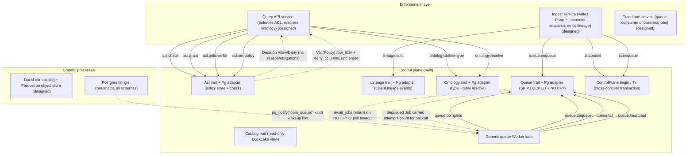

# STPA Control Analysis — weave-hand/loom @ ccaf9ee

_Auto-generated STPA safety model: the unsafe states this system can reach and the control actions that get it there._

<b>How to read this</b> — STPA primer and diagram legend

**STPA** (System-Theoretic Process Analysis) treats the system as *controllers* issuing *control actions* to *controlled processes*, with *feedback* flowing back up. Instead of "what component can fail," it asks "what control action, given or withheld at the wrong time, drives the system into an unsafe state?" "Unsafe" here means a violation of the platform's reason to exist — governed correctness of data access and provenance — not merely a crash.

Read top-down: **Losses** are outcomes we must never cause; **Hazards** are system states that lead to a loss; the **control-structure diagram** shows who commands whom (solid arrows = control actions, dashed = feedback, a node tagged `(designed)` is in the architecture but **not yet built**); the **Unsafe Control Actions** table is the core. Every claim cites `path:line`; unbuilt elements are marked. Semantic, stable IDs mean regenerating changes only the findings that changed.

**Scope.** Built: core traits (acl/ontology/lineage/catalog/queue/tx), Postgres + in-memory adapters (now split into per-concern files), and a generic queue Worker loop with automatic heartbeating at lease/3. Designed-only: Ingest/Transform/Query API services, DataFusion ACL enforcement, Quack wire protocol, DuckLake writer. The ACL store serves policy but never enforces it (core/src/acl.rs:6-9).

Maturity detail

- **Built:** core traits (acl, ontology, lineage, catalog, queue, tx), Postgres adapter (per-concern files), in-memory adapter, Worker loop with auto-heartbeat
- **Designed-only:** Ingest service, Transform service, Query API service, DataFusion ACL enforcement, Quack wire protocol, DuckLake writer

## Control structure

## Losses

| ID | Loss |
|----|------|
| `L.integrity-loss` | Committed data, snapshots, or policy become corrupt or partially applied |
| `L.liveness-loss` | Enqueued work is never processed, or processed past its safety window |
| `L.provenance-loss` | Lineage diverges from what actually happened; provenance is missing or wrong |
| `L.silent-incorrectness` | A query returns wrong rows/columns while appearing successful |
| `L.unauthorized-access` | A subject reads or writes data it is not authorized for |

## Hazards

| ID | Hazard (unsafe state) | → Losses | Maturity |
|----|----|----|----|
| `dangling-target` | A grant/policy/lineage edge/ontology type references a target that does not exist or no longer maps to the intended table | L.unauthorized-access, L.silent-incorrectness | built |
| `lost-wakeup` | A NOTIFY wakeup is missed and eligible work waits up to the poll interval | L.liveness-loss | built |
| `partial-atomic-unit` | Snapshot commit, lineage emit, and enqueue do not all land in one transaction, so provenance/work diverges from data | L.provenance-loss, L.integrity-loss | designed |
| `premature-reclaim` | A still-running job's lock is treated as expired and the job is re-dequeued and run concurrently/again | L.integrity-loss, L.provenance-loss | built |
| `stale-policy` | Query API enforces a cached/old ACL grant or policy after it was revoked or tightened | L.unauthorized-access, L.silent-incorrectness | designed |
| `stuck-job` | A crashed worker leaves a job running with no reaper beyond lock-expiry reclaim, stalling that work | L.liveness-loss | built |
| `type-rebind` | An ontology type is upserted to point at a different physical table, silently redirecting reads under the old policy | L.unauthorized-access, L.silent-incorrectness | built |
| `unenforced-policy` | Policy is stored and served but no service folds the RowFilter / deny_columns into the scan, so all rows/columns are returned | L.unauthorized-access, L.silent-incorrectness | designed |

## Control actions

| ID | Control action | Controller → Process | Maturity | Evidence |
|----|----|----|----|----|
| `acl.check` | coarse allow/deny decision for (subject,action,target) | `query-api` → `acl` | built | src/control-plane/postgres/src/acl.rs:191 |
| `acl.grant` | grant coarse (action,target) to role | `query-api` → `acl` | built | src/control-plane/postgres/src/acl.rs:88 |
| `acl.policies-for` | fetch row/column policy for subject+target | `query-api` → `acl` | built | src/control-plane/postgres/src/acl.rs:221 |
| `acl.set-policy` | create/replace row/column policy for role | `query-api` → `acl` | built | src/control-plane/postgres/src/acl.rs:135 |
| `lineage.emit` | append OpenLineage event with inputs/outputs | `ingest` → `lineage` | built | src/control-plane/postgres/src/lineage.rs:59 |
| `ontology.define-type` | upsert object type + ordered properties | `query-api` → `ontology` | built | src/control-plane/postgres/src/ontology.rs:12 |
| `ontology.resolve` | resolve ontology type to physical TableRef | `query-api` → `ontology` | built | src/control-plane/postgres/src/ontology.rs:159 |
| `queue.complete` | delete finished job | `worker` → `queue` | built | src/control-plane/postgres/src/queue.rs:70 |
| `queue.dequeue` | claim next eligible job, mark running | `worker` → `queue` | built | src/control-plane/postgres/src/queue.rs:41 |
| `queue.enqueue` | enqueue job (autocommit) + NOTIFY | `ingest` → `queue` | built | src/control-plane/postgres/src/queue.rs:10 |
| `queue.fail` | record failure, retry or abandon | `worker` → `queue` | built | src/control-plane/postgres/src/queue.rs:79 |
| `queue.heartbeat` | refresh lock so long job not reclaimed | `worker` → `queue` | built | src/control-plane/postgres/src/queue.rs:110 |
| `tx.commit` | commit cross-concern unit of work | `ingest` → `tx` | built | src/control-plane/postgres/src/transaction.rs:16 |
| `tx.enqueue` | enqueue within transaction (visible only on commit) | `ingest` → `tx` | built | src/control-plane/postgres/src/transaction.rs:24 |

## Unsafe control actions

*The core of the analysis. Each row: a control action made unsafe via one guideword, the hazard/loss it causes, and where in the code it lives.*

| ID | Control action | Guideword | Unsafe condition | Severity | → Hazards | Evidence |
|----|----|----|----|----|----|----|
| `acl.check.not-providing` | `acl.check` | not-providing | Query API service is unbuilt, so no check is issued in the read path and reads are ungoverned | high | unenforced-policy | src/control-plane/core/src/acl.rs:6 |
| `acl.check.providing` | `acl.check` | providing | check returns Allow against a target that was matched only by exact (kind,a,b) string equality, never resolving Type→Table, so a Type grant misses the backing Table (or vice versa) and grants access on the wrong surface | high | dangling-target, unenforced-policy | src/control-plane/postgres/src/lib.rs:112 |
| `acl.grant.providing` | `acl.grant` | providing | grant stored against a target that does not exist or is later rebound, since grant never validates target existence | medium | dangling-target | docs/FUTURE.md:49 |
| `acl.policies-for.not-providing` | `acl.policies-for` | not-providing | row_filter/deny_columns fetched but never folded into the DataFusion plan, returning restricted rows/columns | high | unenforced-policy | src/control-plane/core/src/acl.rs:8 |
| `acl.policies-for.wrong-duration` | `acl.policies-for` | wrong-duration | multiple roles each yield a Policy and the control plane does no merging; an over-permissive role's (absent) filter widens access unless the Query API ANDs correctly | medium | unenforced-policy | src/control-plane/core/src/acl.rs:134 |
| `acl.set-policy.wrong-timing` | `acl.set-policy` | wrong-timing | policy is tightened but in-flight queries already planned against the prior policy continue, reading rows now denied | medium | stale-policy | src/control-plane/postgres/src/acl.rs:135 |
| `lineage.emit.not-providing` | `lineage.emit` | not-providing | standalone Lineage.emit is its own transaction, so a snapshot can commit while the lineage event is never emitted (no atomic third leg) | medium | partial-atomic-unit | src/control-plane/postgres/src/lineage.rs:59 |
| `lineage.emit.providing` | `lineage.emit` | providing | emit stores inputs/outputs and opaque payload with no validation that referenced datasets exist or that envelope matches payload, recording false provenance | medium | dangling-target | docs/FUTURE.md:21 |
| `ontology.define-type.providing` | `ontology.define-type` | providing | upsert silently replaces a type's table binding with no validation that the new table exists or matches existing policy targets | medium | type-rebind, dangling-target | src/control-plane/postgres/src/ontology.rs:12 |
| `ontology.resolve.providing` | `ontology.resolve` | providing | resolve returns the current table mapping even after define-type rebound the type to a different physical table, so a query reads a table the caller's policy was not written for | high | type-rebind, unenforced-policy | src/control-plane/postgres/src/ontology.rs:159 |
| `queue.dequeue.wrong-timing` | `queue.dequeue` | wrong-timing | if heartbeat writes fail (best-effort, fire-and-forget) during a network partition while the original worker still processes the job, locked_at ages past lock_timeout and a second worker reclaims it, duplicating a snapshot-producing transform | high | premature-reclaim | src/control-plane/postgres/src/queue.rs:49 |
| `tx.commit.not-providing` | `tx.commit` | not-providing | Tx carries only enqueue+emit; the snapshot/catalog write is not part of the unit so commit lands lineage+job without the data write (or vice versa) | high | partial-atomic-unit | docs/FUTURE.md:25 |

<b>Not UCAs</b> — 5 examined and rejected

- **await_jobs missed NOTIFY / spurious early return** — bounded by 5s poll fallback that re-checks via dequeue (src/control-plane/worker/src/lib.rs:19,131)
- **crashed-worker job left running** — recovered by lock-expiry reclaim in dequeue; only a UCA when heartbeat fails for a live worker (premature-reclaim)
- **handler never calls heartbeat** — worker loop now heartbeats automatically at lease/3 intervals (src/control-plane/worker/src/lib.rs:97)
- **memory adapter notify_waiters race losing a wakeup** — same poll-timeout fallback bounds latency by design (src/control-plane/memory/src/queue.rs:92)
- **pg_notify fired inside rolled-back transaction** — NOTIFY is buffered until commit so a rolled-back enqueue is silent, not a spurious wakeup (src/control-plane/postgres/src/queue.rs:13)

## Open questions

- ACL targets are matched by exact (kind,a,b) string equality and Type is never resolved to Table for checks — is a Type grant intended to also cover the backing Table at enforcement time, and where does that resolution happen safely?
- Does the Query API AND together multiple per-role policies, and what is the semantics when one matching role has no row_filter (None = unrestricted)? acl-design.md says ANDed but enforcement is unbuilt.
- How are concurrent ingest writers and DuckLake snapshot ordering reconciled (multi-writer is an open question), given catalog writes are not yet wired into Tx?
- Is there a stuck-job reaper distinct from lock-expiry reclaim, or does a job whose worker crashes after lock expiry but is never re-eligible (e.g. wrong kind set) stall indefinitely? FUTURE/ARCHITECTURE list it as TBD.
